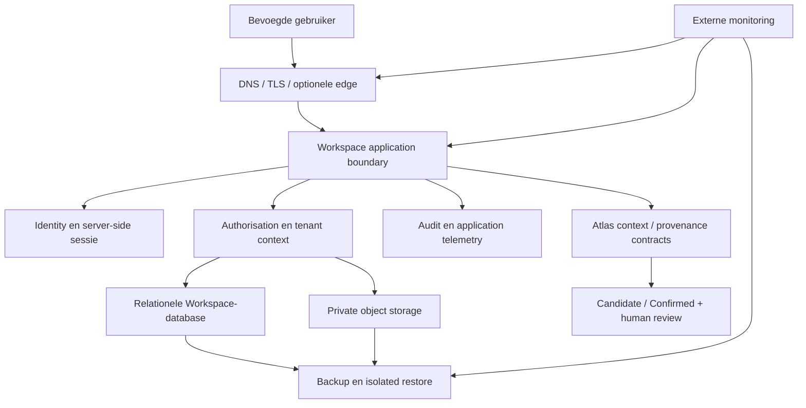

# Project 002C — WBD Workspace Architecture Input

**Datum:** 7 augustus 2026  
**Karakter:** read-only architectuurvertaling en afhankelijkheidsdocumentatie  
**Primaire bron:** `PROJECT-WBD-WORKSPACE-CANONICAL-REVIEW.md`  
**Status:** **ASSESSMENT GO — gereed als architectuurinput; NO-GO voor implementatie, provisioning, deployment en WS.1**  
**Beoogde aansluiting:** toekomstige `002C.9 — Internal Workspace Production Boundary` en `002C.10 — Multi-Organisation Isolation Foundation`

## Bewijs- en beslislabels

| Label | Betekenis |
|---|---|
| **VERIFIED** | Rechtstreeks aangetoond in repositorycode, tests of een actueel resultaatdocument. |
| **DOCUMENTED BUT NOT VERIFIED** | Vastgelegd in canonieke documentatie, maar niet binnen deze opdracht operationeel of extern herbevestigd. |
| **RECOMMENDATION** | Voorgestelde doelrichting; nog geen bestaande productievoorziening of implementatie. |
| **HUMAN DECISION REQUIRED** | Zakelijke, juridische, provider- of risicokeuze die niet door Codex mag worden ingevuld. |
| **GO / NO-GO** | Geldt alleen voor de exact benoemde fase of handeling; een documentatie-GO is nooit automatisch een productie-GO. |

## Statusreconciliatie vóór gebruik

De aangeleverde preflight stelt dat Project 002B nog niet formeel gesloten is omdat de geïsoleerde restoretest nog geen GO zou hebben. Dat was een geldige historische poort, maar is op de datum van dit document **niet meer de actuele repositorystatus**:

- `PROJECT-002B-ISOLATED-RESTORETEST-RESULT-2026-08-06.md` registreert **Resultaat GO**, **Restoretest GO** en **Project 002B GO voor afsluiting**. **VERIFIED**
- `PROJECT-002B-SECURITY-BASELINE-RECOVERY-READINESS.md` registreert dat de recovery- en restorepoorten gesloten zijn en Project 002B GO is voor afsluiting. **VERIFIED**
- De canonieke 002C-reeks bevat inmiddels afgeronde ontwerpbaselines `002C.1` tot en met `002C.7`. Die geven alleen GO binnen hun eigen documentatie-/preflightscope en houden operationele handelingen achter aparte Human GO-poorten. **VERIFIED**
- `002C.8 — Cloudflare WBD Edge Cutover` is niet gestart en is momenteel **NO-GO**. `002C.9` en `002C.10` zijn in 002C.1 uitsluitend als toekomstige projecten benoemd. **VERIFIED**

Daarom omzeilt dit document Project 002B niet, opent het 002B niet opnieuw en claimt het niet dat 002C nog helemaal ongestart is. De actuele grens is: **geen Workspace-infrastructuuruitvoering, geen 002C.8/002C.9/002C.10-uitvoering en geen WS.1 zonder een nieuwe, exact gescopeerde menselijke GO.**

---

## 1. Doelarchitectuur op hoofdlijnen

### 1.1 Product- en eigendomsmodel

De productiearchitectuur behoudt vier afzonderlijke begrippen:

1. **WBD** is de organisatie, eigenaar en eerste interne tenant.
2. **Atlas** is de interne engine/contextlaag die bronnen, provenance, Candidate/Confirmed, interpretatie en attention ondersteunt.
3. **Workspace** is de beveiligde product- en werklaag voor mensen, organisaties, projecten, documenten en beslissingen.
4. **Sportpaleis** is een toekomstige organisatie-instance en practice partner, nooit de naamgever, eigenaar of infrastructuurbasis van het platform.

### 1.2 Kleinste professionele productievorm

De aanbevolen eerste productievorm is een **modulaire monoliet** met een expliciete server-side application boundary. Dat betekent één beheersbare Workspace-applicatie en geen vroegtijdige microservices, Kubernetes, service mesh of database-per-klant.

De grens bestaat minimaal uit:

- een eigen Workspace-host en releasefamilie, gescheiden van de publieke WBD-site en de huidige Experience;
- één server-side web/API-runtime die identiteit, sessie, autorisatie en tenantcontext afdwingt;
- één dedicated relationele Workspace-database;
- één private objectopslag voor documenten, met metadata in de database;
- één append-only auditstroom voor gevoelige handelingen;
- externe beschikbaarheids-, security-, backup- en releasebewaking;
- reproduceerbare, versioned releases met expliciete Human GO en rollback;
- lokale development als primaire bouwomgeving; dedicated staging pas wanneer integratierisico dit aantoonbaar nodig maakt.

De runtime- en databaseprovider worden in dit document bewust niet gekozen. De huidige TransIP shared-hostingbasis blijft geschikt voor de bestaande publieke WBD-site en Experience, maar is niet automatisch geschikt voor de toekomstige Workspace. De Workspace-runtime moet eerst aan het hieronder vastgelegde contract worden getoetst. **RECOMMENDATION**

### 1.3 Logische doelkaart

Cloudflare is in dit model een mogelijke randlaag vóór de applicatie. Het is niet de identity-, authorization-, tenant-, data- of recoveryfoundation.

---

## 2. Workspace → infrastructuur dependency map

| Workspacebehoefte | Productieafhankelijkheid uit 002C | Applicatieverantwoordelijkheid | Kan lokaal vóór provisioning? | Harde productiepoort |
|---|---|---|---|---|
| Application boundary | eigen host/runtime, environmentcontract, TLS, secretinjectie | production entry, routes, API-contract, expliciete 404/fallback | ja, ontwerp en tests | runtime-fit en host-GO |
| Login/identity | identityservice of ondersteunde authcomponent, veilige mail-/resetroute | gebruikersflow, accountkoppeling, identityclaims | ja, adaptercontract en fixtures | provider/owner/recoverybesluit |
| Sessies | server-side sessionstore of veilige database-backed sessie, tijdsbron | cookiebeleid, rotatie, expiry, revoke, CSRF-koppeling | ja, contract- en securitytests | TLS, secret- en sessionstore-GO |
| Server-side authorization | betrouwbare runtime en databaseverbinding | deny-by-default policy per route, query en object | ja, volledig met synthetische data | isolationtests slagen |
| Rollen/permissions | geen aparte infrastructuurservice vereist; wel audit en identityclaims | membership, role, capability en entitlement policies | ja | privilege- en negatieve tests slagen |
| Organisation/tenant isolation | dedicated Workspace-datastore, tenant-aware backup/export | immutable `organization_id`, actieve context, repositories en policies | ja | cross-tenant read/write NO-GO-tests slagen |
| Centrale data | relationele database, migratiepad, encryptie-in-transit, backup | domeinschema, repositories, transacties en migraties | ja met lokale database | providerfit, migration en restore GO |
| Private documenten | private objectstore, lifecycle, encryptie, backup | metadata, tenant/objectkoppeling, upload/download/delete policy | ja met lokale adapter | private access en restore bewezen |
| Auditability | duurzame log-/eventopslag, retentie en monitoring | actor/org/action/object/result/provenance events | ja | auditcontinuïteit en privacyreview |
| Atlas/provenance | duurzame opslag en eventcontract | source, evidence, interpretation, Candidate/Confirmed en review | ja | geen Confirmed zonder geldige lineage |
| Monitoring/attention | externe monitor, alertkanaal, apphealthcontract | veilige health/readiness, genormaliseerde signalen | deels | externe activatie-GO |
| Release/rollback | artifactopslag, deploypad, environmentregister, backup | build, manifest, compatibele migraties, smoke tests | ja | afzonderlijke release- en productie-GO |
| Customer Workspaces | dezelfde platformservices, generieke tenantconfig | workspace instance, capability set, theme config | ja met testtenant | isolationfoundation vóór echte klantdata |

Belangrijk: “kan lokaal” betekent **technisch veilig na een aparte implementatie-GO**. Deze documentatieopdracht zelf start geen van die werkzaamheden.

---

## 3. Verantwoordelijkheidsgrens Project 002C versus WS.1 / WS.2 / WS.3

### A. Project 002C levert infrastructureel

- een getoetst runtime- en hostingcontract voor de interne Workspace;
- gescheiden environment-, host-, netwerk-, TLS- en secretgrenzen;
- een databasevoorziening en private objectopslag die aan backup-, restore-, security- en regio-eisen voldoen;
- identiteitsvoorziening of identity-integratievoorwaarden, inclusief accountownership en herstelpad;
- sessionstore-capability als de gekozen applicatiestrategie dit vereist;
- release-, migratie-, rollback-, monitoring- en herstelmechanismen;
- provider-, account-, credential- en Human GO-governance;
- infrastructuurbewijs dat tientallen tot honderden organisaties kan dragen zonder ze vooraf allemaal te provisionen.

002C bouwt **niet** de Workspace-domeinlogica, rollenmatrix, tenantquery's, Candidate/Confirmed-logica of klantinterfaces.

### B. WS.1 — Canonical Application Boundary & Route Integrity

WS.1 bouwt of corrigeert uitsluitend de application boundary:

- één expliciet route- en runtimecontract;
- correcte route fallbacks en 404-status;
- production entry en environment-adapter op applicatieniveau;
- classificatie real/static/empty/legacy;
- scheiding van publieke site, Experience, WBD Workspace en Atlas;
- build- en contracttests die interne code niet in de publieke release laten lekken.

WS.1 provisiont geen host, DNS, database, identityprovider of productiecredential.

### C. WS.2 — Organisation, Identity & Permission Foundation

WS.2 bouwt:

- `organization`, `workspaceInstance`, `user`, `membership`, `role` en `capability` als generieke domeincontracten;
- actieve organisatiecontext die server-side wordt vastgesteld en gevalideerd;
- deny-by-default autorisatie per capability en resource;
- negatieve cross-tenant tests;
- scheiding tussen applicatierechten en infrastructuurrechten.

002C levert hiervoor identity- en datacapabilities; WS.2 bepaalt de productsemantiek en enforcement in application code.

### D. WS.3 — Durable Data & Document Boundary

WS.3 bouwt:

- repositoryinterfaces en schema/migraties voor dossiers, knowledge, projects, decisions, finance-referenties en audit;
- een private-documentadapter met metadata en provenance;
- browserdata-inventaris en een expliciete import/export/migratiestrategie;
- transacties, idempotency en application-level retention/delete flows;
- audit-emissie en herstelbare documentversies waar vereist.

002C levert de beheerde datastore, objectstore, backup- en restoregrens; WS.3 bepaalt wat de gegevens betekenen.

---

## 4. Minimale productiecomponenten

| Component | Minimale capability | Waarom minimaal | Nu niet nodig |
|---|---|---|---|
| Workspace web/API runtime | TLS, server-side code, environmentconfig, logs, health/readiness | auth, sessie, autorisatie en tenantcontext kunnen niet browser-only | autoscalingcluster, containers als doel op zich |
| Identity-integratie | unieke identities, herstel, veilige login, revoke | online gebruik zonder identity is NO-GO | complexe enterprise SSO-suite |
| Sessionmechanisme | server-side revoke/expiry, veilige cookies | browserlokale state is geen gedeelde veilige sessie | meerdere gespecialiseerde sessionservices zonder loadtrigger |
| Relationele Workspace-DB | transacties, FK/constraints, migraties, backups | organisation-first data en audit vereisen duurzame samenhang | database per tenant |
| Private objectstore | private-by-default, object-ID, lifecycle, restore | documenten horen niet in publieke assets of alleen IndexedDB | publieke document-CDN |
| Secretmanagement | environmentgescheiden, niet in Git/artefact/log | credentials en signing keys moeten buiten code blijven | permanente Codex-toegang |
| Auditopslag | append-only gedrag, retentie, querybaar per org/object | human-in-control en evidence vereisen traceerbaarheid | volledige datawarehousepipeline |
| Externe monitoring | availability, TLS, health, release, backupfreshness | gezonde productie moet stil en aantoonbaar zijn | full distributed tracing vóór behoefte |
| Backup/restore | DB + objects + release/configmetadata, off-provider, testrestore | backupbestaan zonder herstelbewijs is onvoldoende | multi-region active-active |
| Release/rollback | immutable artifact, manifest, versioning, migrationclass, Human GO | huidige releasecultuur moet behouden blijven | onbewaakte continuous deployment |

Een aparte queue, worker, websocketdienst, zoekcluster of analyticsplatform wordt pas toegevoegd wanneer een echte capability die nodig heeft.

---

## 5. Identity-, authentication-, sessie- en permissionrichting

### Richting

1. Gebruik één canonieke WBD identity per persoon; koppel toegang via memberships aan organisaties en workspace instances.
2. Gebruik voor browsergebruik server-side beheerde sessies of een aantoonbaar gelijkwaardig, revocable mechanisme.
3. Cookies zijn minimaal `Secure`, `HttpOnly` en passend `SameSite`; sessies hebben absolute en idle expiry, rotatie na login/privilegewijziging en server-side revoke.
4. State-changing requests krijgen CSRF-bescherming, Origin/Host-validatie en content-typebeperkingen.
5. Autorisatie is deny-by-default en wordt voor iedere route, query, download en mutatie server-side uitgevoerd.
6. Rollen zijn compacte policybundels; capabilities blijven de precieze beslislaag. Begin met weinig rollen, bijvoorbeeld beheerder en standaardlid, en voeg alleen bewezen rollen toe.
7. Een Workspace-role geeft nooit TransIP-, Cloudflare-, databasebeheer- of deploymentrechten. Infrastructuurtoegang blijft onder 002C.6.
8. Cloudflare Access kan later een extra toegangspoort voor een interne host zijn, maar vervangt de applicatie-identiteit en organisation-permissions niet.

### Providerkeuze

Een managed identityprovider, een frameworkgebonden identitycomponent of een beperkte eigen credentialstore kan pas worden gekozen na vergelijking op:

- accountowner en onafhankelijk recoverypad;
- Europese privacy-/verwerkersvoorwaarden waar relevant;
- MFA- en password-resetmogelijkheden;
- audit, export en offboarding;
- sessierevocation en integratie met de gekozen runtime;
- kosten bij tientallen/honderden organisaties;
- voorkomen van provider lock-in via een kleine application adapter.

**HUMAN DECISION REQUIRED:** wie als eerste gebruikersgroep toegang krijgt, welke MFA-eis geldt en of een externe identityprovider contractueel wenselijk is.

---

## 6. Organisation- en tenant-isolation-richting

De kleinste schaalbare basis is een gedeelde applicatie en in eerste instantie één gedeelde Workspace-database met harde organisation-scoping. Dat is proportioneel voor tientallen tot honderden organisaties, mits de isolatie niet alleen een UI-filter is.

### Verplichte invariant

- iedere tenantgebonden rij draagt een immutable technische `organization_id`;
- een `workspace_instance_id` bepaalt productconfiguratie en verwijst naar een organisatie, maar vervangt de organisatiegrens niet;
- klantnamen en branding zijn metadata, geen infrastructuuridentiteit;
- actor, actieve organisation en toegestane membership worden op de server vastgesteld;
- iedere repositorymethode vereist expliciete tenantcontext;
- unieke constraints en relaties bevatten waar nodig `organization_id` om cross-tenant koppeling te blokkeren;
- ieder object in private storage is via database metadata aan precies de bevoegde organisatie(s) gekoppeld;
- exports, deletes, audit, retention, jobs en backups bewaren tenantcontext;
- automatische tests bewijzen dat cross-tenant read, write, link, search, export en download worden geweigerd.

Database row-level security is een mogelijke extra laag wanneer de gekozen engine dit betrouwbaar ondersteunt. Het is geen excuus om application-authorisatie over te slaan en geen reden om nu al de database-engine vast te zetten.

Een apart schema, database of deployment per klant blijft een later risicogestuurd pad voor contractuele isolatie, dataresidentie of uitzonderlijk risico. Sportpaleis krijgt in de generieke basis hoogstens test-/seeddata onder een neutraal tenant-ID; er komt geen Sportpaleis-server, -database-eigenaar of hardcoded enginepad.

---

## 7. Database- en centrale datarichting

### Aanbeveling

Gebruik een **dedicated relationele Workspace-database**, logisch gescheiden van de bestaande Experience-database. De database ondersteunt minimaal:

- ACID-transacties en foreign keys;
- consistente migraties en expliciete schemaversie;
- encrypted transport en least-privilege applicationcredentials;
- gerichte, versleutelde backups en geïsoleerde restores;
- redelijke indexering voor tenant, project, tijdlijn, documenten en audit;
- export/delete per organisatie zonder andere tenants te beschadigen;
- capaciteit voor tientallen/honderden organisaties zonder vooraf sharding te bouwen.

### Enginekeuze

De huidige Experience gebruikt MariaDB/MySQL, maar dat is geen automatische keuze voor Workspace. `PostgreSQL` en `MariaDB/MySQL` zijn beide valide kandidaten wanneer zij het contract halen. 002C moet de keuze baseren op runtimecompatibiliteit, transactionele eisen, migratietooling, backup/PITR, connectiebeveiliging, operationele beheerlast, regionale verwerking en totale kosten. **HUMAN DECISION REQUIRED**

### Eigendomsgrens

- 002C provisiont service, netwerk/toegang, secretmetadata, backup en herstel.
- WS.3 bezit schema, migraties, repositories, constraints en domeintransacties.
- Productiedata wordt nooit naar gewone local development of publieke preview gekopieerd.
- Lokale ontwikkeling gebruikt synthetische fixtures en een lokaal equivalente database.
- Candidate/Confirmed wordt als domeintoestand met provenance gemodelleerd; infrastructuur mag dit onderscheid niet afvlakken.

---

## 8. Private document- en objectstorage-richting

### Aanbevolen patroon

Gebruik private objectopslag — bij voorkeur een beheerde S3-compatibele capability of aantoonbaar gelijkwaardig — met uitsluitend metadata in de relationele database.

Een documentrecord bevat minimaal:

- opaque `object_id` en storage key zonder persoons- of klantnaam;
- `organization_id`, eigenaar/source, documenttype en classificatie;
- contenttype, grootte, hash, created/updated timestamps en actor;
- provenance en relaties naar dossier/project/case/cost evidence;
- versie-, retention-, delete- en restorestatus;
- optionele malware-scanstatus wanneer uploads door meerdere of externe gebruikers beginnen.

### Toegangsregels

- bucket/container en objecten zijn private-by-default;
- upload/download loopt via de bevoegde applicatie of zeer kortlevende signed URL;
- authorization vindt vóór URL-uitgifte én bij metadataquery plaats;
- authenticated HTML, API, uploads, downloads en documenten worden nooit publiek gecachet;
- object- en metadatawijzigingen schrijven een audit-event;
- DB en objectstore worden als één herstelset geregistreerd, ook wanneer hun backups technisch apart lopen.

Een private filesystemmap op dezelfde host is alleen tijdelijk acceptabel als accesscontrole, atomiciteit, quota, backup, off-provider herstel en later migratiepad aantoonbaar voldoen. Browser IndexedDB en repositorybestanden blijven ontwikkel-/migratiebronnen, geen productieobjectstore.

---

## 9. Security boundary

### Infrastructuur- en accountgrens

- Human authority blijft vereist vóór account-, provider-, credential-, DNS-, database- of productiehandeling.
- Codex krijgt geen permanente infrastructuuraccount, secret, recoverycode of gedeelde login.
- Secrets staan niet in Git, buildartefact, clientbundle, logs, screenshots of documentatie.
- Credentials zijn per environment en capability gescheiden, minimaal bevoorrecht, task-scoped waar mogelijk en revocable.
- Productie en local development delen geen credentials of productiegegevens.

### Applicatiegrens

- TLS end-to-end; geen Cloudflare Flexible-mode.
- veilige securityheaders, cookiebeleid, CSRF, Origin/Host-controle en server-side inputvalidatie;
- rate limiting bij login/reset/upload en bewezen abusegevoelige routes;
- uploadlimieten, typevalidatie, content sniffing-bescherming en later malwarecontrole;
- foutmeldingen en logs zonder tokens, cookies, documentinhoud of onnodige persoonsgegevens;
- audit voor login, logout/revoke, permissionwijziging, cross-tenant denial, documentactie, export/delete, statuspromotie en productiebeheer;
- dependency- en secret-scans in de releasepreflight, zonder automatische productieactie.

### Trustmodel

Atlas-interpretatie is geen automatische waarheid. Bron, provenance en context blijven bewaard; Candidate wordt alleen door expliciete geldige review Confirmed. Een infrastructuur- of monitoringssignaal mag aandacht openen, maar niet zelfstandig een zakelijke beslissing of klantstatus veranderen.

---

## 10. Backup- en recoveryrichting

De bestaande 002C.4-baseline blijft leidend. Workspace voegt de volgende recoveryset toe:

1. relationele Workspace-database en schemaversie;
2. private objecten plus manifest/hash en bijbehorende metadata;
3. immutable applicatieartefact en releasemanifest;
4. environment- en secretmetadata zonder secretwaarden;
5. identity-/membershipexport voor zover de gekozen provider dit veilig ondersteunt;
6. auditdata en retentiebeleid.

### Minimale eisen vóór productie

- zakelijke RPO/RTO per dataklasse door een mens vastgesteld;
- providerbackup plus versleutelde off-provider kopie met onafhankelijk recoverypad;
- consistente DB/object-manifestkoppeling;
- backupregister met owner, bron, datum, hash, retentie, encryptieklasse en laatste restorebewijs;
- restore naar een geïsoleerde niet-productieomgeving zonder bronwijziging;
- validatie van schema, constraints, tenantisolatie, objecthashes en representatieve application reads;
- periodieke restorecadans en expliciete procedure voor één tenant zonder andere tenants te overschrijven;
- delete/retention en legal hold als productbeleid, niet stilzwijgend gelijkgesteld aan backupretentie.

Een volledige provider-/hostingrestore is geen standaardrollback voor een enkele Workspace-release. Code-, database- en objectrecovery krijgen aparte impactklassen en Human GO.

---

## 11. Monitoringrichting

### Extern en gezond = stil

Monitoring draait buiten dezelfde failure domain als de Workspace-runtime en normaliseert signalen naar `INFO`, `ATTENTION` en `URGENT`. Gezonde controles produceren geen dagelijkse ruis.

| Controle | Minimale intentie | Privacygrens |
|---|---|---|
| Workspace availability | status, latency, herkenbare niet-gevoelige release-ID | geen login of datawrite |
| TLS/DNS | hostname, keten, expiry, drift | publieke metadata |
| `/health` | proces/runtime leeft | geen dependency- of secretdetails |
| `/ready` | veilige readiness van DB/objectstore waar mogelijk | geen recordinhoud of identifiers |
| Authsynthetic | later een afgeschermde testflow | geen productiegebruiker of gedeeld secret in logs |
| Release identity | actief artifact/manifest komt overeen | hashes/IDs zonder broncode |
| Application errors | severity, routeklasse, correlation ID | redact tokens, bodies, documenten, PII |
| Backup freshness | laatste geldige DB/object/auditbackup | geen backupinhoud |
| Restore evidence | laatste geïsoleerde geslaagde restore | alleen status en bewijsreferentie |
| Capacity | runtime, DB-connections, quota, objectvolume | aggregate per environment |
| Security events | auth failures, denials, rate limits, abnormal uploads | minimaal noodzakelijke actor-/tenantmetadata |

Application health, platformhealth en meetfout blijven aparte toestanden. Atlas mag de genormaliseerde signalen later als evidencebron gebruiken; de externe monitor activeert geen autonome productbeslissing.

---

## 12. Deployment-, release- en rollbackrichting

### Environmentmodel

- `local`: primaire bouwomgeving met synthetische data en lokale adapters;
- `integration/staging`: pas dedicated wanneer identity callbacks, providerdatastore, migrations, uploads, proxygedrag of productiegelijke releasevalidatie dit nodig maken;
- `production-workspace`: eigen runtime, data, secrets, host en releaseregister;
- publieke WBD-site, preview en Experience blijven aparte releasefamilies.

### Releasepad

1. leg een schone broncommit en dependency lock vast;
2. test en bouw in een geïsoleerde context;
3. produceer één immutable artifact plus machineleesbaar manifest;
4. classificeer code-, config-, database- en objectstorage-impact;
5. maak vóór risicovolle migratie een geldig herstelpunt;
6. valideer candidate zonder productieactivatie;
7. registreer exacte Human GO voor environment en change set;
8. activeer gecontroleerd;
9. bewijs extern release-ID, routes, auth/session, tenant denial, DB/objectstore, audit en monitoring;
10. beslis `GO`, `ROLLED BACK` of `NO-GO` en trek tijdelijke toegang in.

### Rollback

- code-only: activeer vorige bekende goede artifact wanneer schema/API compatibel is;
- additive compatible migration: oude app mag alleen terug als compatibiliteit vooraf bewezen is;
- behavioral/destructive migration: geen blinde code-rollback; gebruik forward-fix, gerichte down-migratie of gerichte restore na aparte GO;
- documenten/objecten: herstel via versioning/manifest en reconcileer database metadata;
- identity/config: behoud versieerbare configuratiemetadata en provider-specifiek herstelrunbook;
- DNS/Cloudflare: blijft een aparte 002C.8-state machine, geen onderdeel van een gewone apprelease.

Continuous integration mag controles automatiseren. Productieactivatie blijft voorlopig human-in-control.

---

## 13. Cloudflare- en netwerkrichting

Cloudflare Free is **architectonisch optioneel** en staat niet op het kritieke pad voor lokale WS.1–WS.3-ontwikkeling. De huidige 002C.7-beslissing blijft:

- **GO** als mogelijke latere WBD-edgelaag;
- **NO-GO** voor huidige nameserver-, DNSSEC- of proxycutover;
- toekomstige Workspace/API is een eigen security-, cache- en uploadpreflight.

Als Cloudflare later wordt gebruikt:

- TLS is `Full (strict)` en origin HTTPS blijft geldig;
- Workspace, API, uploads, downloads en private documenten zijn standaard cache-bypass;
- identity/authorization/tenantisolatie blijft originverantwoordelijkheid;
- trusted-proxy en client-IP parsing worden tegen spoofing getest;
- WAF/rate limits volgen pas uit echt verkeer en false-positiveanalyse;
- Cloudflare Access kan defense-in-depth bieden voor een interne host, niet de app-rolematrix;
- accountrol en Workspace-apprecht blijven gescheiden;
- DNS, mail, DNSSEC, monitoring en rollback voldoen eerst aan de 002C.7-poorten.

De Workspace-architectuur mag niet afhankelijk worden van een specifieke edgeprovider. Een DNS-only start zonder Cloudflare is valide wanneer de origin- en applicatiebeveiliging voldoen.

---

## 14. Wat lokaal blijft

De lokale omgeving blijft voorlopig de primaire bouwplaats voor:

- route-/runtimecontracten en buildgrenzen van WS.1;
- organisation-, membership-, role- en capabilitymodellen van WS.2;
- negatieve tenant- en permissiontests met synthetische organisaties;
- database- en objectstore repositoryinterfaces van WS.3;
- versioned migraties tegen een lokale equivalente database;
- documentadapter tegen een lokale private storage-emulator of afgeschermde filesystemadapter;
- audit-, provenance- en Candidate/Confirmed-contracten;
- browserdata-inventaris en droge migraties op kopieën/fixtures;
- UI/mobile/accessibility-verbeteringen die geen online identiteit of productieclaim vereisen;
- releasebuild, manifest, securitychecks en lokale rollbackrehearsal.

Lokaal blijven ook browser- en repositorygebaseerde bewijsdata totdat een expliciete migratiebeslissing bestaat. Lokale data wordt niet stilzwijgend als productiebron aangemerkt. Productiedata, productiecredentials en productiebackups horen niet in de gewone werkruimte.

---

## 15. Wat productie nodig heeft

Vóór de eerste echte online WBD Workspace zijn gezamenlijk nodig:

- goedgekeurde doelgroep en organisatiegrens;
- toegewezen Workspace-host/runtime met TLS en environmentregister;
- werkende identity, recovery, sessie-expiry en revoke;
- server-side permissions en bewezen tenantisolatie;
- dedicated relationele database met migratie- en restorebewijs;
- private objectstorage met authorize/upload/download/delete/restorebewijs;
- audittrail en veilige application logging;
- CSRF-, cookie-, header-, rate-limit- en uploadcontrols;
- immutable release en compatibele rollback;
- externe monitoring en onafhankelijk alertkanaal;
- RPO/RTO, provider- én off-provider backups en geslaagde isolated restore;
- privacy-/retentie-/verwerkersbesluiten waar provider of persoonsgegevens dit vereist;
- menselijke release-GO en bemenst observatievenster.

Ontbreekt één van identity, authorization, tenantisolatie, centrale data, private documents, audit, restorebaarheid of rollback, dan blijft online dagelijks gebruik **NO-GO**.

---

## 16. Wat bewust later komt

- microservices, Kubernetes, service mesh en multi-region high availability;
- database/schema/deployment per organisatie zonder contractuele risicotrigger;
- queue/worker/websockets voordat een concrete capability langdurige taken vereist;
- enterprise SSO/SCIM en complexe role designer;
- volledige CI/CD-productieactivatie zonder Human GO;
- Cloudflare proxying en Access vóór 002C.7/002C.8-gates;
- uitgebreide WAF-, bot- en rate-limitregels zonder verkeersbewijs;
- customer self-service provisioning, billing en subscriptions;
- customer-specific mail, branding en communicatiestromen;
- Sportpaleis-productie-instance;
- production datawarehouse, full tracing of SIEM;
- dedicated staging zolang lokale en gecontroleerde candidatevalidatie volstaat.

Dedicated staging wordt noodzakelijk zodra minstens één van deze triggers optreedt: externe identity callback, provider-specifieke DB/objectstore-integratie, risicovolle migratie, background job, proxy/WAF-interactie, multi-user acceptatie of een productieflow die lokaal niet representatief kan worden bewezen.

---

## 17. Risico's, blockers en menselijke beslissingen

| Punt | Status | Gevolg / vereiste beslissing |
|---|---|---|
| Huidige Workspace heeft geen production entry | **BLOCKER online** | WS.1 plus runtimecontract nodig; geen public-site fallback gebruiken. |
| Identityprovider/-strategie niet gekozen | **HUMAN DECISION REQUIRED** | Kies owner, recovery, MFA, privacy, export/offboarding en adaptergrens. |
| Workspace-runtime/providerfit onbekend | **BLOCKER provisioning** | Read-only fit assessment vóór host/account/pakketwijziging. |
| Database-engine en hostingvorm open | **HUMAN DECISION REQUIRED** | Vergelijk MariaDB/MySQL en PostgreSQL op contract, herstel en beheerlast. |
| Private objectstorage niet bestaand | **BLOCKER documents online** | Kies regio/provider, lifecycle, backup en signed-accessmodel. |
| RPO/RTO en retentie voor Workspace-data open | **HUMAN DECISION REQUIRED** | Zakelijk/privacybesluit vóór productie. |
| Geen bewezen multi-tenant isolation | **BLOCKER echte tweede organisatie** | WS.2-tests en 002C.10-infravalidatie vereist. |
| Browser/repositorydata is niet centraal | **BLOCKER dagelijks multi-device** | WS.3 migratieplan; niet automatisch importeren. |
| Audit is gefragmenteerd | **BLOCKER hoge-risicoflows** | Canoniek auditcontract en duurzame opslag nodig. |
| Dedicated staging ontbreekt | **CONDITIONAL** | Alleen blocker wanneer productiegelijke integratie niet lokaal kan. |
| 002C.4 operationele off-provider opslagkeuzes open | **BLOCKER production recovery** | Owner, contract, encryptie, key recovery en restore-GO. |
| 002C.3 externe monitoring niet geactiveerd | **BLOCKER production observability** | Provider, owner, alertkanaal en activation-GO. |
| Cloudflare cutover is NO-GO | **GEEN Workspace-foundationblocker** | DNS-only/originveilig ontwerp blijft mogelijk; 002C.8 apart. |
| TransIP huidige siteslots/runtimelimieten | **UNKNOWN** | Read-only account/providerfit door mens; geen aanname of wijziging. |
| Sportpaleis als hardcoded bewijsdata | **DESIGN RISK** | Test met neutrale tweede tenant; klantconfig als data, geen fork. |

De grootste architectuurrisico's zijn niet capaciteit maar het per ongeluk vermengen van product en infrastructuur, UI-filtering verwarren met tenantisolatie, documenten publiek maken, en een productiehost kiezen vóór runtime/data/recoverycontracten vaststaan.

---

## 18. Voorgestelde fasering binnen Project 002C

De labels hieronder zijn **planningslabels**, geen toestemming en geen reeds gestarte projecten. Bij formele start hoort de Workspace-track onder de reeds gereserveerde `002C.9`-grens; `002C.10` blijft de multi-organisation infravalidatie. Codex-werklast en eurocreditbandbreedtes zijn voorlopige planningsaannames, geen facturatie of gemeten verbruik.

| Fase | Doel en deliverable | Complexiteit | Verwachte Codex-werklast | Voorlopige credits | Risico | Afhankelijkheden | Verwachte menselijke handelingen |
|---|---|---:|---|---:|---:|---|---|
| **002C-WSP.0 — Architecture Input** | dit canonieke document, statusreconciliatie en A/B/C/D-grens | laag | 1 documentatiereview | €5–15 | zeer laag | Canonical Review, actuele 002B/002C-docs | inhoudelijk reviewen; geen externe actie |
| **002C-WSP.1 — Runtime & Service Fit Assessment** | read-only decision record voor host/runtime, identity, DB, objectstore, regio, kosten en exitpad | middel | 1–2 gerichte onderzoeks-/documentatietaken | €15–40 | laag | WSP.0; actuele provider-/accountcapabilities door mens | doelgroep/RPO/MFA/dataregio aangeven; accountschermen secretvrij bevestigen indien nodig |
| **002C-WSP.2 — Production Boundary Design** | environment-, netwerk-, secret-, health-, release-, migration- en rollbackcontract; nog geen provisioning | middel | 2–3 ontwerp-/contracttaken | €25–60 | laag/middel | WSP.1-keuzes; 002C.2/3/4/6 | ontwerp, kosten en blast-radius goedkeuren; expliciete provisioning-GO apart |
| **002C-WSP.3 — Non-production Foundation** | na GO: minimale runtime, DB, objectstore, identity-integratie en monitoring in een lege/synthetische omgeving | hoog | 3–6 implementatie-/validatietaken | €60–150 | middel/hoog | WSP.2 GO; provideraccounts; WS.1/2/3-contracten voldoende stabiel | accounts/pakketten/voorwaarden kiezen; credentials zelf beheren; iedere externe write autoriseren |
| **002C-WSP.4 — Security, Isolation & Recovery Proof** | end-to-end auth/session/CSRF, cross-tenant denial, private objects, audit, backup en isolated restorebewijs | hoog | 3–5 test-/hardeningtaken | €60–130 | hoog | WSP.3; WS.2/WS.3 implementatie; RPO/retentie | testscope en privacyreview; restore- en security-GO; resultaten beoordelen |
| **002C-WSP.5 — Release Readiness** | immutable candidate, migratieclassificatie, external monitoring, rollbackrehearsal en release evidence | middel/hoog | 2–4 release-engineeringtaken | €40–100 | hoog | WSP.4 GO; 002C.2/3/4/6 operationeel | releasewindow, autorisator en rollbackcriteria bevestigen; geen automatische livegang |
| **002C-WSP.6 — First Production Activation** | afzonderlijke beperkte WBD-internal productieactivatie, observatievenster en eindbesluit | hoog | 2–4 preflight/validationtaken; menselijke uitvoering centraal | €40–100 | zeer hoog | alle eerdere gates; privacy/owner/operations gereed | expliciete productie-GO per change; providerhandelingen; live beoordeling; rollbackbesluit |
| **002C.10 — Multi-Organisation Infrastructure Validation** | bewijs dat platformservices backup/export/restore/audit en capacity tenant-aware dragen vóór echte tweede klant | hoog | 2–5 audit-/testtaken | €50–125 | zeer hoog | WSP.4/5; WS.2 isolation compleet | risico-/contractmodel kiezen; mogelijk juridische/privacyreview; tweede tenant-GO |

De bandbreedtes kunnen overlappen omdat providerkeuze, bestaande tooling, noodzakelijke menselijke wachttijd en gevonden gaps de werkelijke omvang bepalen. Werkelijke Codex-eurocredits zijn in deze omgeving niet zichtbaar en worden daarom niet als realisatiecijfer gerapporteerd.

### Expliciet onderscheid per werkstroom

| Werkstroom | Mag na afzonderlijke lokale GO parallel? | Moet op 002C wachten? |
|---|---|---|
| **A — 002C infrastructure deliverables** | read-only ontwerp en lokale contractfixtures wel | alle accounts, provisioning, externe integratie en productieactivatie |
| **B — WS.1/WS.2/WS.3 application work** | WS.1 en provider-neutrale contract-/testdelen van WS.2/WS.3 wel | production adapters, echte identities/data en online release |
| **C — Safe local parallel work** | routefixes, schemas, policies, negative tests, repositories, local adapters, mobile/a11y | niets hiervan mag productieclaims of echte klantdata gebruiken |
| **D — Must wait for 002C** | niet van toepassing | online login, echte customer tenant, centrale productiedata, private uploads, monitoringactivation, DNS/Cloudflare, deployment en migratie van echte data |

---

## 19. GO/NO-GO-poorten per fase

| Fase | GO wanneer | NO-GO wanneer | Huidige status |
|---|---|---|---|
| **WSP.0** | 20 vereiste onderwerpen, actuele status en verantwoordelijkheidsgrenzen zijn volledig en zonder writes vastgelegd | document omzeilt 002B/002C-baselines of suggereert impliciete uitvoering | **GO — dit document gereed voor review** |
| **WSP.1** | aparte menselijke GO voor read-only assessment; doelgroep, volume, data- en herstelvragen kunnen worden beantwoord | accountwijziging, aankoop of credentialinzage nodig blijkt zonder aparte GO | **NO-GO om automatisch te starten** |
| **WSP.2** | WSP.1 heeft een gekozen/voorkeursrichting en alle open besluiten/effecten zijn expliciet | ontwerp vermengt public/Experience/Workspace of kiest Sportpaleis als basis | **NO-GO om automatisch te starten** |
| **WSP.3** | exact providerplan, kosten, owner, privacy, rollback en credentialsboundary zijn goedgekeurd; afzonderlijke provisioning-GO | ontbrekende owner/recovery, onduidelijke regio/DPA, geen exitpad of production write in scope | **NO-GO** |
| **WSP.4** | synthetische omgeving stabiel; WS.2/3-contracten gereed; test- en restoreplan goedgekeurd | cross-tenant tests, private access, audit of restore niet aantoonbaar | **NO-GO** |
| **WSP.5** | WSP.4 GO; monitoring en off-provider recovery operationeel; immutable artifact en rollbackrehearsal slagen | een blocker uit identity/isolation/data/documents/audit/recovery blijft open | **NO-GO** |
| **WSP.6** | expliciete productie-GO, bemenst window, owner, candidatebewijs, external probes, backup en directe rollback | algemene eerdere GO, onvolledig bewijs, geen menselijke aanwezigheid of gekoppelde DNS/Cloudflarewijziging | **NO-GO** |
| **002C.10 / tweede echte organisatie** | production foundation stabiel; negatieve isolationtests en tenant-aware export/delete/backup/restore/audit slagen; juridische grenzen akkoord | Sportpaleis-hardcoding, UI-only filtering, gedeelde object-URL, ongerichte providerrestore of onbekende dataretentie | **NO-GO** |

Los hiervan blijft `002C.8 — Cloudflare WBD Edge Cutover` **NO-GO CURRENTLY** conform 002C.7. Een Workspace-release mag die cutover niet impliciet meenemen.

---

## 20. Concrete eerste read-only opdracht na 002B GO

Omdat Project 002B aantoonbaar al GO is en 002C.1–002C.7 als ontwerpbaselines bestaan, is de actuele eerste Workspace-specifieke vervolgopdracht:

### `002C-WSP.1 — Workspace Runtime & Service Fit Assessment`

**Doel:** vergelijk uitsluitend read-only de huidige en realistische productieopties met het contract uit dit document, zonder account-, pakket-, provider- of repositorywijziging.

**Minimale onderzoeksvragen:**

1. Welke server-side runtimes, processmodellen, logs, health endpoints, scheduled/background capabilities en releasepaden zijn aantoonbaar beschikbaar?
2. Kan een Workspace-host voldoende worden gescheiden van public en Experience, inclusief secrets, logs, data en rollback?
3. Welke identityopties voldoen aan owner/recovery/MFA/privacy/export/offboarding en passen bij de runtime?
4. Welke relationele databaseoptie voldoet aan transactions, migrations, TLS, backup/restore, capacity en beheerlast?
5. Welke private objectstorage voldoet aan regio, encryption, signed access, lifecycle, backup/restore en kosten?
6. Welke dedicated staging-trigger en goedkoopste veilige non-productievariant gelden?
7. Welke onderdelen van 002C.3/4/6 zijn operationeel nodig vóór een eerste productiecandidate?
8. Welke maandelijkse providerkosten, quota, lock-in- en exitrisico's horen bij iedere haalbare variant?

**Deliverable:** één decision record met maximaal drie varianten, een aanbevolen kleinste professionele basis, evidence/unknowns, kostenband, risico's, exitpad, Human Decisions en een afzonderlijke GO/NO-GO voor uitsluitend het ontwerp van `002C-WSP.2`.

**Niet toegestaan:** accountlogin door Codex, secrets, aanschaf, provisioning, DNS, Cloudflare, databasecreate, objectstorecreate, deployment, echte data, Workspace-code of start van WS.1.

**Huidige beslissing:** **GO als aanbevolen volgende read-only opdracht na afzonderlijke menselijke opdracht-GO; niet gestart door dit document.**

---

## Eindstatus

### Assessment

**GO.** De Canonical Review is vertaald naar een proportionele, organisation-first productiearchitectuur en een concrete Project 002C-afhankelijkheidsgrens. De richting ondersteunt WBD als eerste tenant en later tientallen tot honderden organisaties zonder nu enterprise-infrastructuur te bouwen.

### Gereedheid als Project 002C-input

**GO.** Dit document is gereed als Workspace-specifieke architectuurinput voor de toekomstige `002C.9`- en `002C.10`-grenzen.

### Uitvoering

**NO-GO.** Dit document geeft geen toestemming voor:

- application- of Workspace-codewijziging;
- start van WS.1, WS.2 of WS.3;
- account-, credential-, database-, storage-, hosting-, DNS-, TLS- of Cloudflarehandeling;
- monitoringactivation, data-export, restore, deployment of productie-write;
- Sportpaleis-implementatie of echte customer onboarding;
- 002C.8-, 002C.9- of 002C.10-uitvoering.

### Menselijke GO vereist voor

- scope en start van de eerste read-only `002C-WSP.1`-opdracht;
- eerste online doelgroep en MFA-/identityrichting;
- runtime-, database- en objectstoragekeuze;
- RPO/RTO, retentie, regio en privacy-/verwerkersvoorwaarden;
- iedere provisioning-, account-, credential-, monitoring-, backup-, restore-, release- of productiehandeling;
- ieder lokaal WS.1/WS.2/WS.3-implementatieproject;
- tweede datadragende organisatie.

### Credits

Werkelijke Codex-eurocredits en afwijking ten opzichte van de preflightinschatting zijn niet zichtbaar. Er wordt daarom geen gerealiseerd bedrag verzonnen. De gevraagde voorlopige fasebandbreedtes staan uitsluitend als planningsaannames in sectie 18.

### Uitvoeringsbevestiging

- Geen application code gewijzigd.
- Geen Workspace-implementatie gestart.
- Geen infrastructuur, database, objectstorage, account, credential, DNS, Cloudflare of productie gewijzigd.
- Geen deployment, restore of destructieve handeling uitgevoerd.
- Geen Bitwarden-, wachtwoord-, recoverycode- of secretinhoud ingezien.
- Bestaande Project 002-documentatie niet gewijzigd.

**STOP:** wacht op menselijke review en expliciete GO.
