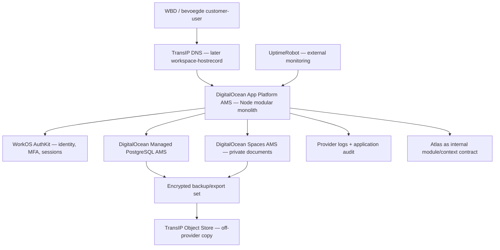

# Project 002C-WSP.1 — Workspace Runtime & Service Fit Assessment

**Datum:** 7 augustus 2026  
**Karakter:** read-only infrastructuurassessment  
**Status:** **ASSESSMENT GO — voorkeursrichting bepaald; NO-GO voor implementatie en iedere externe wijziging**  
**Primaire bronnen:** `PROJECT-WBD-WORKSPACE-CANONICAL-REVIEW.md` en `PROJECT-002C-WORKSPACE-ARCHITECTURE-INPUT.md`  
**Beslisser:** menselijke review en afzonderlijke GO per vervolgopdracht

## Bewijslabels

| Label | Betekenis |
|---|---|
| **VERIFIED** | Rechtstreeks vastgesteld in de repository of in actuele officiële documentatie. |
| **DOCUMENTED BUT NOT VERIFIED** | Eerder canoniek vastgelegd, maar in deze opdracht niet opnieuw via account, server of productie bevestigd. |
| **ESTIMATE** | Raming op basis van actuele publieke prijzen of laag-verbruiksscenario; geen offerte. |
| **HYPOTHESIS** | Technisch aannemelijk, maar nog te bewijzen in een latere preflight of testomgeving. |
| **RECOMMENDATION** | Voorgestelde richting; nog niet besteld, ingericht of gebouwd. |
| **HUMAN DECISION REQUIRED** | Keuze over kosten, contract, privacy, risico of bedrijfscontinuïteit die niet door Codex wordt genomen. |

Alle providerprijzen zijn publieke lijstprijzen op de documentdatum. Valuta, btw, promoties, pakketwijzigingen en werkelijke checkout kunnen afwijken. Er is niet ingelogd bij TransIP of een andere provider.

---

## 1. Executive summary

De huidige TransIP Webhosting Pro-omgeving is een goede basis voor de bestaande publieke WBD-site en PHP/MySQL-Experience, maar niet de voorkeursruntime voor de TypeScript Workspace. De repository bevat een Vite/TypeScript-browserapp; WBD-writes bestaan alleen als Vite-developmentmiddleware, de publieke build sluit WBD/Atlas bewust uit en er is geen production Node-process, identity-, tenant-, data- of private-documentgrens. **VERIFIED**

### Voorkeursarchitectuur

De kleinste professionele basis die veilig kan meegroeien is:

1. **DigitalOcean App Platform in Amsterdam** voor één Node.js/TypeScript modulaire monoliet die frontendassets en server/API vanaf één beveiligde origin bedient.
2. **DigitalOcean Managed PostgreSQL in dezelfde Amsterdam-regio/VPC** als dedicated Workspace-database.
3. **DigitalOcean Spaces Standard in Amsterdam**, private, zonder CDN, met objectversioning voor primaire documenten.
4. **WorkOS AuthKit** als managed identity/MFA/sessionprovider, met een kleine adapter en een interne mapping naar WBD-organisaties en memberships.
5. **UptimeRobot Solo** volgens de bestaande 002C.3-voorkeursrichting voor externe uptime, TLS, health en release-identiteit.
6. **TransIP Object Store** als client-side versleutelde off-provider backupbestemming voor Workspace DB-/objectmanifests, niet als primaire database.
7. **TransIP blijft ongewijzigd** registrar/DNS en host van public/preview/Experience; de Workspace wordt een aparte releasefamilie en host.
8. **Cloudflare blijft optioneel en NO-GO voor cutover**; het is niet nodig om deze basis te bouwen.
9. **Local development blijft primair**; een tijdelijke/dedicated integrationomgeving wordt pas geactiveerd voor identity callbacks, managed DB/storage, migrations en security-/restorebewijs.
10. **Geen microservices, Kubernetes, queue, Redis of database per tenant** zolang praktijkbelasting dit niet vereist.

### Workspace implementation continuity

De infrastructuur is nadrukkelijk geen eindpunt. Na menselijke keuze en de vereiste gates wordt de bestaande lokale WBD Workspace stapsgewijs doorgebouwd via `WS.1` tot en met `WS.5` en daarna de verdere capabilities. De huidige sterke Workspace-shell, rustige WBD-beeldtaal en bewezen lokale workflows blijven de basis. **Een volledige frontendrebuild of frameworkmigratie is niet aanbevolen en mag alleen terugkomen wanneer een afzonderlijk technisch bewijs aantoont dat de bestaande TypeScript-implementatie een concrete capability blokkeert.**

De voorkeursruntime ondersteunt daarom progressieve uitbreiding: de huidige frontend kan behouden blijven, terwijl een echte server/API-, identity-, data- en documentgrens erachter wordt toegevoegd. Infrastructurele volwassenheid en productontwikkeling lopen gecontroleerd samen; geen van beide wacht onnodig op de volledige afronding van de andere.

### Waarom deze richting

Een TransIP VPS is goedkoper in één factuur en technisch geschikt, maar legt OS-patching, firewall, Node-processbeheer, PostgreSQL-upgrades, databasebackups, logrotatie en incidentherstel bij de enige beheerder. Een managed PaaS/DB-combinatie kost naar verwachting circa **€38–45 per maand extra exclusief btw** bij de eerste WBD-internal fase, maar haalt juist die continue systeembeheerlast uit WBD. **ESTIMATE**

De voorkeur is geen onomkeerbare platformkeuze: Node.js, PostgreSQL en S3 zijn open/gebruikelijke interfaces; providerconfig blijft klein en data-export wordt onderdeel van de exitcriteria.

**Assessmentbesluit:** **GO** voor de architectuurrichting en menselijke besluitvorming. **NO-GO** voor accountaanmaak, aanschaf, provisioning, DNS, credentials, code, database, storage, monitoringactivatie en deployment.

---

## 2. Current-state evidence

### 2.1 Repository en applicatie

| Feit | Bewijsstatus | Betekenis voor infrastructuur |
|---|---|---|
| Frontend is vanilla TypeScript/Vite; `package.json` heeft nu alleen build-/test-devdependencies. | **VERIFIED** | Er is geen bestaand productieframework of appserver dat stilzwijgend kan worden gedeployed. |
| WBD Foundation- en factuurwrites draaien als Vite-developmentmiddleware. | **VERIFIED** | De ontwikkelserver is geen production boundary. |
| Publieke build sluit interne WBD/Atlas-code uit. | **VERIFIED** | Public en Workspace moeten aparte entry/releasefamilies blijven. |
| WBD-data staat in IndexedDB, localStorage en repositorybestanden. | **VERIFIED** | Centrale DB/objectstorage en expliciete migratie zijn vereist. |
| Geen WBD-auth, sessie, server-side autorisatie of tenantisolatie. | **VERIFIED** | Online dagelijks gebruik blijft NO-GO. |
| Tests en public-only build slaagden in de Canonical Review. | **VERIFIED** | De lokale productbasis kan behouden blijven; geen UI-rewrite nodig voor hostingkeuze. |

### 2.2 Bestaande TransIP-omgeving

| Feit | Bewijsstatus | Oordeel |
|---|---|---|
| WBD gebruikt Webhosting Pro met public, preview en Experience; 3/3 websiteslots bezet. | **DOCUMENTED BUT NOT VERIFIED** | Geen vrij zelfstandig Workspace-siteobject. |
| Hosting biedt PHP 8.2, SSH/SFTP, MySQL, automatische TLS en providerbackups. | **DOCUMENTED BUT NOT VERIFIED**; productcapabilities publiek bevestigd | Sterk voor huidige PHP/Experience, geen bewezen Node-serviceboundary. |
| Twee MySQL-databases: historische WordPress en Experience; Experience-capaciteit circa 15 GB. | **DOCUMENTED BUT NOT VERIFIED** | Capaciteit alleen maakt de DB nog geen Workspace-tenantfoundation. |
| Geen VPS, managed runtime, objectstore of zelfstandige Workspace-host in de actuele inventaris. | **DOCUMENTED BUT NOT VERIFIED** | Iedere Workspace-productierichting voegt een nieuwe servicegrens toe. |
| Eén TransIP-accountlogin, geen extra controlepaneelgebruikers. | **DOCUMENTED BUT NOT VERIFIED** | Least privilege moet via servicecredentials en menselijke governance worden begrensd. |
| 002B restoretest en Project 002B-afsluiting zijn GO. | **VERIFIED in canonieke resultaatdocumenten** | 002B blokkeert dit assessment niet meer. |

### 2.3 Account-only onbekenden

De volgende punten zijn niet veilig uit publieke bronnen of repositorybewijs af te leiden. Een mens moet ze later read-only controleren; Codex logt niet in:

- werkelijke huidige maandfactuur en contractprijzen van WBD Pro, Fara Core en domeinen;
- actuele Webhosting Pro-quota, databaseaantal en remote DB/TLS-mogelijkheden;
- of een persistent Node.js-process officieel op het bestaande webhostingpakket wordt ondersteund;
- actuele siteslot-/upgradeopties en contractimpact;
- actuele DPA/subverwerkersovereenkomst in het TransIP-account;
- beschikbare accountrollen voor nieuwe OpenStack/Object Store-services.

Omdat TransIP publieke webhostingdocumentatie PHP, MySQL, SSH en cronjobs beschrijft maar geen production Node-processcontract bewijst, wordt Node op shared hosting **UNKNOWN en NO-GO zonder providerbevestiging**. Zelfs bij technische mogelijkheid blijven 3/3 slots, proceslifecycle en tenant-/release-isolatie bezwaren.

---

## 3. Recommended production architecture



### Architectuurkenmerken

- Eén deployable application service, niet één service per capability.
- Eén origin voor frontend en API beperkt CORS, cookie- en CSRF-complexiteit.
- Atlas blijft een interne module/contextlaag en krijgt geen afzonderlijk netwerkproces totdat een concrete workload dat vereist.
- PostgreSQL en objectstorage zijn uitsluitend via server-side adapters bereikbaar; browsercredentials bestaan niet.
- Identity is managed, maar Workspace-authorization en canonical `organization_id` blijven in de applicatie/database.
- Alle customer Workspaces gebruiken dezelfde generieke runtime en services; organisatie/configuratie is data.
- De providergrenzen zijn vervangbaar via Node-, PostgreSQL-, OIDC/JWT- en S3-contracten.

### Productieprofielen

| Profiel | Gebruik | Beschikbaarheid | Kostenrichting |
|---|---|---|---|
| **P1 — WBD internal** | eerste beperkte productie, kleine gebruikersgroep | één appinstance en single-node managed DB; downtime binnen gekozen RTO acceptabel | voorkeursstart |
| **P2 — First customer** | echte Sportpaleis/customer-data | zelfde ontwerp; herbeoordeel tweede appinstance, DB-standby, support/SLO en privacy | schaal-up, geen redesign |
| **P3 — 10–100 organisations** | meerdere kleine tenants | horizontale appscale, DB-resize/pooling, tenant-capacitymonitoring | usage-driven |

P1 is professioneel in security, herstel en beheerbaarheid, maar niet high availability. Dat is een expliciete zakelijke keuze, geen verborgen garantie.

---

## 4. Runtime recommendation

### 4.1 Realistische opties

| Optie | Fit | Kostenindicatie | Beheerlast | Risico | Oordeel |
|---|---|---:|---:|---:|---|
| **DigitalOcean App Platform AMS** | native Node build/run, HTTPS, healthchecks, logs, revisions/rollback, managed OS | $10/mnd voor 1 vCPU/1 GiB fixed | laag | tweede provider; single instance geen HA | **VOORKEUR** |
| **TransIP VPS 4 GiB** | volledige Node/PostgreSQL/reverse-proxyvrijheid | vanaf circa €20/mnd publieke lijst | hoog | OS/DB/process/backups bij één beheerder | **ALTERNATIEF** |
| **TransIP shared Webhosting Pro** | huidige PHP/MySQL-sitebasis | bestaande kosten | middel, maar app-rewrite | Node/process niet bewezen; 3/3 slots; vermengde boundary | **NIET AANBEVOLEN** |
| **Kubernetes/microservices** | technisch mogelijk | veel hoger | zeer hoog | overengineering | **NO-GO** |

### 4.2 Voorkeur

Gebruik één DigitalOcean App Platform web service in Amsterdam, initieel het publieke `1 vCPU / 1 GiB fixed`-profiel van $10/mnd. De service:

- gebruikt de dan actuele ondersteunde Node LTS-versie, gepind in manifest/tooling;
- serveert de gebouwde frontend en dezelfde-origin API;
- heeft één expliciete startcommand en poort;
- gebruikt stateless processmemory; sessies/data staan extern;
- exposeert minimale `/health` en `/ready` endpoints zonder gevoelige details;
- schrijft gestructureerde stdout/stderr-logs zonder secrets/PII;
- krijgt resource-, restart- en erroralerts;
- kan later naar een groter plan of extra instance zonder appgrenswijziging.

Processmanager, OS-patching, reverse proxy en platformrestart worden door de PaaS afgehandeld. Geen Dockerfile is nodig wanneer een native Node-buildpack volstaat; een container wordt pas gebruikt als reproduceerbaarheid of systeembibliotheken dit aantoonbaar vereisen.

### 4.3 Waarom geen VPS als voorkeur

Een VPS is geen slechte architectuur. Voor WBD is het wel een structureel operationeel commitment: hardening, SSH, firewall, unattended/security updates, Caddy/Nginx, systemd, PostgreSQL, vacuum/upgrades, diskcapacity, backups, restore, malware/incidentrespons en onderhoudsvensters. De bespaarde circa €10–20 per maand weegt in deze fase niet op tegen die menselijke beheerlast.

**Alternatief:** kies een TransIP VPS van minimaal 4 GiB pas wanneer de mens bewust zelfbeheer accepteert, een onderhoudsrunbook en patchowner aanwijst, en een aparte DB-/restorepreflight slaagt.

---

## 5. Application boundary

| Laag | Verantwoordelijkheid | Niet de verantwoordelijkheid |
|---|---|---|
| Browser/frontend | renderen, toegestane interactie, veilige formulierrequests, geen trust | tenant bepalen, authorization beslissen, secrets bewaren |
| Node web/API | login callback, sessievalidatie, active org, authorization, repositories, uploads, audit, health | provideraccountbeheer |
| Atlas/context | provenance, interpretation, Candidate/Confirmed, attentionnormalisatie | identityprovider, tenantsecurity of autonome zakelijke beslissing |
| PostgreSQL | duurzame relaties, constraints, transactions, tenantkolommen, auditrecords | UI-permissions alleen |
| Private objectstorage | encrypted/private objects, versioning, lifecycle | canonical metadata of authorizationbesluit |
| Identityprovider | authenticatie, MFA, herstel, identity/session lifecycle | WBD-domeinrollen en datarechten als enige bron |
| Infrastructuur | runtime, TLS, networking, secretsinjectie, metrics, backups, release/rollback | productsemantiek en klantconfiguratie |

De production app mag niet voortbouwen op Vite-developmentmiddleware. WS.1 definieert de production entry; WS.2 definieert identity/membership/permissions; WS.3 definieert data/documentrepositories. Dit assessment bouwt geen van die onderdelen.

### Continuïteit van de bestaande Workspace

- De bestaande Workspace-shell, navigatieconcepten, layouttokens en WBD-beeldtaal worden **behouden**.
- De vanilla TypeScript-frontend hoeft voor de gekozen Node-runtime niet te worden vervangen.
- WS.1 verplaatst productionverantwoordelijkheid uit Vite-developmentmiddleware naar een expliciete server/API-grens; het is geen visuele rebuild.
- WS.2 en WS.3 voegen identity, organisationcontext en duurzame repositories toe achter bestaande schermen en workflows.
- WS.4 verbetert mobile navigation, typography en interaction density pas nadat de huidige visuele werkelijkheid als screenshotbaseline is vastgelegd.
- WS.5 vervangt statische Home-/attentionsignalen door betrouwbare bronnen; de rustige presentatie en het principe “attention rather than notifications” blijven behouden.
- Projects, History, implementation economics, Codex preflight-/kosthistorie, finance continuity, communication/mail, personalisation en customer Workspaces volgen op dit fundament in plaats van parallelle klantspecifieke forks te vormen.

---

## 6. Identity/MFA recommendation

### 6.1 Vergelijking

| Richting | Security | Complexiteit | Startkosten | Lock-in | Beheerlast | Oordeel |
|---|---:|---:|---:|---:|---:|---|
| **WorkOS AuthKit managed** | sterke hosted flows, MFA, sessions, recovery, orgs | laag/middel | $0 tot 1M MAU zonder betaalde enterprise connections; billing info vereist | middel | laag | **VOORKEUR, privacycheck verplicht** |
| **Better Auth self-hosted library** | goede TS-basis met DB sessions, CSRF, 2FA | middel/hoog | licentie €0; mail/operations apart | laag | middel/hoog | **EU/control-alternatief** |
| **Zelf cryptografie/authflows bouwen** | afhankelijk van eigen foutloosheid | zeer hoog | verborgen onderhoudskosten | laag | zeer hoog | **NO-GO** |
| **Clerk Pro** | mature hosted auth/MFA/orgs | laag | vanaf $25/mnd; B2B-add-ons kunnen sterk stijgen | middel/hoog | laag | valide maar minder kostvoorspelbaar |
| **ZITADEL Cloud Pro** | sterke multi-org IAM | middel | vanaf $100/mnd | middel | laag | te zwaar voor huidige schaal |

### 6.2 Voorkeur en grens

Gebruik WorkOS AuthKit Hosted UI voor login, e-mailverificatie, password recovery, MFA en session lifecycle, mits menselijke DPA-/data-transferreview akkoord is.

- WBD maakt een interne `user` aan met `identity_provider = workos` en provider subject-ID.
- WorkOS organization-ID is een externe identityclaim, niet de canonical database-tenantkey.
- De applicatie mapt identity + gekozen organisatie naar een interne membership.
- Iedere request valideert token/session, expiry, issuer, audience en membership server-side.
- Alleen applicatierechten staan in Workspacepolicies; geen provider- of infrastructuurrechten.
- WBD-admins krijgen verplichte MFA; aanbeveling is MFA voor iedere productiergebruiker.
- Logout en accountdisable revoken actieve sessies; password reset revokeert relevante sessies.
- App-audit registreert identity-eventtype en interne actor-ID, nooit tokens of passwordinformatie.

### 6.3 Blocker

WorkOS-datalocatie, DPA, subverwerkers, internationale doorgifte, accountowner, recovery en export/offboarding zijn in deze opdracht niet contractueel beoordeeld. **HUMAN DECISION REQUIRED.** Als EU-only identitydata verplicht is en WorkOS dit niet passend kan bewijzen, wordt Better Auth op dezelfde PostgreSQL-database het voorkeursalternatief, met een afzonderlijke securityreview en transactionele e-mailprovider.

---

## 7. Organisation isolation model

### Canoniek model

```text
identity provider user
        ↓ mapping
internal user ── membership ── organization
                                  ↓
                           workspace_instance
                                  ↓
                     capability_set + theme_config
```

### Verplichte isolationregels

- Interne IDs zijn opaque UUID/ULID-achtige technische identifiers; namen/slugs zijn wijzigbare metadata.
- Iedere tenantgebonden rij heeft immutable `organization_id`.
- Iedere repositoryquery vereist expliciete actieve organisationcontext.
- PostgreSQL Row Level Security wordt als defense-in-depth aanbevolen naast applicatiepolicies.
- Composite foreign keys/unique constraints voorkomen waar nodig cross-tenant relaties.
- Objectkeys bevatten geen klantnaam; DB-metadata koppelt object aan `organization_id` en resource.
- Search, export, audit, jobs, backupmanifest en restore bewaren tenantcontext.
- Negatieve tests dekken read, write, link, list, search, export, upload, download en delete over tenantgrenzen.
- WBD is de eerste organisation record; Sportpaleis is later een tweede data-instance onder dezelfde generieke contracten.
- Dedicated schema/database/deployment blijft een later risicogestuurd alternatief, geen default.

Identityproviderorganisaties helpen bij loginselectie, maar zijn niet voldoende als database-isolatie of authorizationbewijs.

---

## 8. Database recommendation

### 8.1 Vergelijking

| Optie | Voordelen | Nadelen | Oordeel |
|---|---|---|---|
| **Managed PostgreSQL AMS** | ACID/FK, RLS, JSON waar nodig, migrations, TLS, metrics, daily PITR, managed updates, schaalbaar | $15.15/mnd start; single node niet HA; tweede provider | **VOORKEUR** |
| **Bestaande TransIP MySQL** | reeds aanwezig, bekende Experience-context, lage incrementele kosten | Experience-gekoppeld, tenantmodel ontbreekt, app-private networking/TLS/remote toegang onbekend, geen vrij runtimecontract | **NIET ALS WORKSPACE-PRODUCTIEDB** |
| **Self-hosted PostgreSQL op TransIP VPS** | lage directe kosten, volledige controle | patching, backup, upgrades, disk en herstel bij WBD | **ALTERNATIEF na beheer-GO** |
| **SQLite/files** | eenvoudig lokaal | concurrency, multi-user, backup/isolation en managed scale onvoldoende | **NO-GO productie** |

### 8.2 Voorkeur

Gebruik een dedicated DigitalOcean Managed PostgreSQL-cluster in AMS3, hetzelfde VPC/failure-region als de app. Start alleen voor de beperkte WBD-internal fase met het kleinste single-node plan wanneer de mens expliciet de lagere beschikbaarheid accepteert. Dagelijkse point-in-time backups, SSL, metrics en automatische updates zijn providercapabilities; off-provider logical dumps blijven nodig.

### 8.3 TransIP-databasecapaciteit expliciet beoordeeld

- **Geschikt voor de huidige Experience:** ja, volgens bestaande canonieke evidence.
- **Technisch mogelijk als tijdelijke Workspace-proef:** onbekend; alleen na menselijke read-only bevestiging van extra DB/quota, remote encrypted toegang, credentialisolatie en herstelbereik.
- **Geschikt als voorkeursproductiedatabase voor Workspace:** **nee**. De runtime-, isolation-, private-network-, release- en recoverygrens is onvoldoende bewezen en zou nieuwe Workspace-risico's aan de bestaande Experience koppelen.
- **Moet de Experience-DB worden vervangen:** **nee**. Zij blijft ongewijzigd; Workspace krijgt een aparte datastore.

### 8.4 Migratie- en schaalpad

WS.3 beheert versioned migrations. Initieel: shared schema, `organization_id`, RLS-defense, connection pooling en indexes. Later: vertical resize en standby vóór sharding of tenantdatabases. Geen productiegegevens in local/preview.

---

## 9. Private storage recommendation

### Vergelijking

| Optie | Kosten | Sterkte | Grens | Oordeel |
|---|---:|---|---|---|
| **DigitalOcean Spaces Standard AMS** | $5/mnd basis | S3, private objects, presigned URLs, versioning, lifecycle, app/DB-regio bij elkaar | aparte backup nodig; CDN expliciet uit | **VOORKEUR** |
| **TransIP Object Store primair** | €0.01/GB/mnd + €0.01/GB egress publiek | S3/SWIFT, NL, 3× AZ, zeer goedkoop | cross-provider runtime; account/granular access verifiëren | sterk alternatief / off-provider voorkeur |
| **VPS filesystem** | inbegrepen | eenvoudig | zelfde disk/failure domain, backup/migratie/scale zelf | niet als primaire managed richting |
| **Database blobs** | DB inbegrepen | transactioneel | DB-groei, backup/restore en streaming ongunstig | niet voor gewone documenten |

### Voorkeur

Gebruik een private DigitalOcean Space in AMS3:

- Standard Storage, CDN uit;
- file listing en objecten private;
- opaque keys zonder persoonsgegevens/klantnamen;
- versioning aan en lifecycle pas na retentiebesluit;
- bucket-scoped applicationcredential met minimale read/write/delete-rechten;
- korte presigned URLs of application streaming na server-side authorization;
- hash, size, type, organisation, provenance, version en retentionstatus in PostgreSQL;
- uploadlimiet/typevalidatie vanaf eerste productie; malware scanning vóór customeruploads of zodra risico dit vereist.

Objectversioning is bescherming tegen overschrijven/verwijderen, geen volledige backup. Een versleutelde export/replicatie naar TransIP Object Store vormt de onafhankelijke providerlaag.

---

## 10. Backup/recovery model

| Laag | Primair herstel | Onafhankelijke kopie | Validatie |
|---|---|---|---|
| Code/release | Git + immutable App Platform revision/artifact | release manifest buiten runtime | iedere release smoke/rollback |
| PostgreSQL | managed daily PITR/providerbackup | client-side encrypted logical dump naar TransIP Object Store | kwartaal isolated restore + na materiële migration |
| Documents | Spaces versioning + manifest | encrypted object/manifestcopy naar TransIP Object Store | kwartaal sample/hash; halfjaarlijks representative restore |
| Identity/config | WorkOS/provider state + secretvrije configregister | user/org export waar ondersteund; runbook | halfjaarlijkse recovery/offboardingtest |
| Audit | PostgreSQL + export | meegenomen in DB backup, mogelijk aparte append-only export later | query/continuitycheck |
| DNS/config | TransIP export en releasebewijs | repository/secure operationeel archief | vóór/na wijziging |

### Eerste cadans

- managed DB PITR/providerbackup: providerdefault dagelijks/continu volgens capability;
- encrypted logical DB dump: dagelijks, plus vóór iedere DB-impactrelease;
- documentmanifest en gewijzigde objectkopieën: dagelijks;
- release/config/DNS evidence: bij iedere wijziging;
- integrity/freshnesscontrole: dagelijks geautomatiseerd, gezond = stil;
- isolated DB+object restore: per kwartaal en na wijziging van backupmethode/schema/provider;
- off-provider backupaccount heeft onafhankelijk recoverykanaal en client-side encryptie waarvan de sleutel niet bij het archief staat.

Geen globale providerrestore als standaard applicatierollback. Tenantgerichte restore wordt vóór een tweede echte organisatie ontworpen en bewezen.

---

## 11. RPO/RTO proposal

Onderstaande waarden zijn een voorstel, geen SLA en pas canoniek na menselijke keuze.

| Scenario/capability | Voorgestelde RPO | Voorgestelde RTO | Reden |
|---|---:|---:|---|
| Gewone DB-fout binnen provider/PITR | **≤ 4 uur** | **≤ 4 uur** | beperkt intern gebruik, managed restorepad |
| Document overschreven/verwijderd | **≤ 1 uur / laatste versie** | **≤ 4 uur** | primary objectversioning |
| Hele DigitalOcean-provider/account onbeschikbaar | **≤ 24 uur** | **≤ 1 werkdag** | dagelijkse encrypted TransIP-kopie; handmatige rebuild acceptabel |
| Code/releasefout zonder incompatible migration | **0 dataverlies** | **≤ 1 uur** | vorige immutable revision |
| Incompatible datamigration | pre-change herstelpunt | **≤ 8 uur** | datareconciliatie en aparte Human GO |
| Identityproviderstoring | geen dataverliesclaim; login tijdelijk geblokkeerd | **≤ 1 werkdag** of providerherstel | geen onveilige bypasslogin bouwen |

**HUMAN DECISION REQUIRED:** accepteert WBD een providerbreed disaster-RPO van 24 uur en een RTO van één werkdag voor de eerste interne fase? Voor de eerste betalende/datadragende customer worden deze waarden contractueel herbeoordeeld. Een strenger doel kan extra backupfrequentie, standby/HA en hogere kosten vereisen.

---

## 12. Monitoring baseline

Gebruik de bestaande 002C.3-voorkeur: UptimeRobot Solo, na afzonderlijke activatie-GO.

| Signaal | Bron | Attentionregel |
|---|---|---|
| Workspace uptime/marker | extern HTTP, 60 sec | bevestigde multi-check failure → `URGENT` |
| HTTPS/TLS/domain | extern | 30/14 dagen `ATTENTION`, 7 dagen/ongeldig `URGENT` |
| `/health` | extern, niet-mutatief | proces/release mismatch zonder data → `ATTENTION/URGENT` volgens duur |
| `/ready` | veilig intern/extern contract | herhaalde DB/storage-unready → `URGENT` |
| DB CPU/connections/storage | DigitalOcean metrics | 70/85/95%-drempels, gededupliceerd |
| Spaces volume/errors | provider/app metrics | trend/capacity `ATTENTION`; access failure `URGENT` |
| Application errors | structured logs | errors per correlation/type, geen body/PII |
| Auth/security | WorkOS + app audit | brute force/denials/revoke anomalies, geen notificatie per event |
| Backup freshness | backupregister/heartbeat | gemiste cadence `ATTENTION`; geen herstelbare kopie `URGENT` |
| Restore evidence | backupregister | verlopen/mislukt bewijs `ATTENTION/URGENT` |
| Release identity | external marker + manifest | onbekende revision `URGENT` |

Eén open incident per `organization + environment + target + signal_type`. Herstel sluit alleen na twee gezonde checks of nieuw geldig herstelbewijs. Geen groene dagelijkse mails en geen direct provideralert als Workspacewaarheid; Atlas kan later genormaliseerde evidence interpreteren.

Geen Sentry/Datadog/full tracing in fase 1. Providerlogs, DB-metrics, UptimeRobot en de application audit zijn voldoende totdat een echte diagnostische gap ontstaat.

---

## 13. Network/Cloudflare role

### Eerste productie

- TransIP blijft authoritative DNS.
- Een toekomstige `workspace.webuildanddesign.nl`-record wijst pas na aparte DNS-GO naar App Platform.
- App Platform levert managed HTTPS/custom-domainrouting.
- App ↔ managed PostgreSQL gebruikt dezelfde AMS VPC/private connectivity waar ondersteund.
- Objectstorage gebruikt private S3 requests/presigned URLs; geen publieke bucket/CDN.
- Alleen HTTPS is publiek; database en managementinterfaces nooit.

### Cloudflare

Cloudflare Free kan later DNS/proxy, DDoS, beperkte WAF/rate limiting en edgecontrole toevoegen, maar:

- 002C.8 cutover is momenteel NO-GO;
- identity, sessions, authorization, tenantisolatie en originbeveiliging blijven applicatie-/platformtaken;
- authenticated HTML/API/documents blijven cache-bypass;
- Cloudflare Access is hoogstens defense-in-depth, niet de Workspace-rolematrix;
- voeg Cloudflare niet tegelijk toe met de eerste Workspace-productierelease.

De voorkeursarchitectuur werkt volledig zonder een WBD Cloudflare-account en voorkomt daarmee een onnodige gecombineerde DNS/appmigratie.

---

## 14. Deployment/release model

```text
local development
→ tests + typecheck + security/build boundary
→ immutable build/revision + manifest
→ preflight (code/config/DB/object impact)
→ tijdelijke integration candidate waar vereist
→ Human GO voor exact environment/change
→ controlled App Platform deployment
→ migrations alleen volgens aparte impactclass/backup-GO
→ live smoke + auth/session/tenant/object/audit checks
→ GO / rollback / forward-fix
```

### Automatiseren

- clean checkout, dependency lock, tests, TypeScript/build;
- public/internal boundary checks;
- artifact/revision ID en manifest;
- secret/dependency scan zonder automatische remediatie;
- schema migration dry-run en compatibilityclass;
- health/smoke probes en release-marker;
- backupfreshnesscheck en evidencecapture.

### Human GO blijft verplicht

- provider/account/provisioning;
- production environment/config/secret change;
- database migration;
- DNS/custom domain;
- deployment activation;
- rollback met data-impact;
- restore, delete, retention of customer onboarding.

### Rollback

App Platform kan eerdere revisions terugzetten; dat is alleen voldoende wanneer schema en objectcontract backward-compatible zijn. Destructieve migrations worden niet gecombineerd met gewone apprelease en vereisen een volledig herstel-/forward-fixplan. Releasebewijs koppelt commit, revision, manifest, environment, migrationclass, backup-ID, GO, smoke, monitoring en eindbesluit.

---

## 15. Environment strategy

### Nu nodig

1. **Local** — primaire bouwomgeving, lokale PostgreSQL-equivalent en storage-adapter, synthetische data.
2. **Production** — pas na alle gates; dedicated app/DB/object/authconfig.

### Tijdelijk/dedicated integration wanneer nodig

Een niet-productieomgeving is vóór de eerste release feitelijk nodig voor:

- WorkOS staging callback en sessie/MFA-flow;
- managed PostgreSQL TLS/VPC/migrations;
- private Spaces upload/download/versioning;
- cross-tenant/securitytests;
- backup + isolated restore;
- release/rollbackrehearsal.

Dit hoeft niet vanaf dag één permanent betaald te worden. Gebruik een afzonderlijke provideromgeving/project, synthetische data en tijdelijke kleinste resources; vernietiging/pauze pas na evidence en aparte GO. Geen kopie van productiegegevens.

### Wanneer permanent staging nodig wordt

- regelmatige releases met DB-migrations;
- meerdere ontwikkelaars/reviewers;
- customeracceptatie;
- background jobs/webhooks;
- proxy/WAF-/mailintegraties;
- productiegelijke regressie die lokaal niet betrouwbaar is.

Conclusie: **local + production blijft het structurele startmodel, met een geïsoleerde tijdelijke integrationomgeving als verplichte releasevoorbereiding.** Dit corrigeert de voorkeur niet, maar maakt de eerste veilige online integratie expliciet.

### Veilige lokale parallelle Workspace-fases

| Workspacefase | Veilig lokaal na aparte GO | Infrastructuurafhankelijk deel | Startvoorwaarde |
|---|---|---|---|
| **WS.1 — Route / Application Boundary** | route manifest, correcte fallbacks/404, production-entrycontract, buildgrenzen | werkelijke runtimeadapter en deployment | kan direct lokaal na GO; geen provider nodig |
| **WS.2 — Identity / Organisation / Permissions** | domeinmodellen, memberships, roles/capabilities, policy- en negative tests met fictieve identities | WorkOS-adapter, callback, echte sessions en production secrets | providerneutrale delen parallel met WSP.2A/2B |
| **WS.3 — Durable Central Data** | repositories, PostgreSQL-schema/migrations, S3-adaptercontract, audit en droge browserdata-migratie | managed PostgreSQL/Spaces, backup en restore | lokale equivalente services en synthetische data |
| **WS.4 — Mobile Experience / Navigation / Typography** | navigation, reflow, tap targets, typography en accessibility met fixtures | echte identity/org/data states voor eindvalidatie | eerst visuele screenshotbaseline; bij voorkeur WS.1-routekaart stabiel |
| **WS.5 — Dynamic Home / Attention** | sourcecontracten, situationmodel, fixtures en rustige UI | echte identity/org/project/data- en monitoringsbronnen | WS.2/WS.3-contracten voldoende stabiel |

Geen fase mag online readiness claimen op basis van alleen lokale fixtures. WS.4 kan visueel parallel lopen, maar de uiteindelijke dagelijkse mobile validatie wacht op echte identity- en datastates. WS.5 wacht voor productiegedrag op betrouwbare centrale bronnen en externe monitoringnormalisatie.

---

## 16. Privacy/data infrastructure considerations

| Onderwerp | Infrastructurele eis | Application requirement | Later governancewerk |
|---|---|---|---|
| Persoonsdata | AMS-regio, TLS, encrypted storage, least privilege | dataminimalisatie en veldclassificatie | privacygrondslag/notice/DPIA indien nodig |
| Identity | DPA/subprocessors/transfer review; MFA; recovery | interne actor mapping en authorization | customer SSO/SCIM-contracten |
| Documenten | private bucket, opaque keys, versioning, backup | uploadtype/size, provenance, permissions, delete | retenties per documenttype/legal hold |
| Logs | beperkte retentie, EU-region waar mogelijk, redaction | geen tokens/bodies/PII; correlation IDs | formeel logretentiebeleid |
| Backups | client-side encryption off-provider, owner/recovery | tenantmanifest, delete/reconcile | wettelijke retentie versus verwijderplicht |
| Toegang | providerrollen en servicecredentials gescheiden | membership/capabilities deny-by-default | periodieke access review |
| Verwijdering | lifecycle pas na beleid, herstelbare procedure | object + metadata + auditworkflow | contractuele offboardingtermijnen |
| Audit | duurzame opslag en beperkte operatoraccess | actor/org/action/object/result/provenance | export/retentie/toezicht |

**Geen juridisch beleid wordt in dit assessment vastgesteld.** De mens beoordeelt DigitalOcean-, WorkOS-, UptimeRobot- en TransIP-contract/DPA/subverwerkers, internationale doorgifte, regio, bewaartermijnen en customerafspraken vóór productie.

---

## 17. Monthly cost model

### 17.1 Bestaande kosten

| Item | Publieke referentie | Werkelijke WBD-kosten | Status |
|---|---:|---:|---|
| TransIP Webhosting Pro vergelijkbaar 3-sitepakket | €15,99/mnd excl. btw reguliere publieke lijst | **UNKNOWN** | promotie/contract/factuur menselijk controleren |
| TransIP Webhosting Core vergelijkbaar 1-sitepakket (Fara) | €9,99/mnd excl. btw reguliere publieke lijst | **UNKNOWN** | geen Workspace-kost; governance apart |
| `.nl`-domeinen/mail | varieert | **UNKNOWN** | bestaande baseline, geen nieuwe Workspacekost |

De bestaande factuur wordt niet geïnspecteerd; bovenstaande prijzen zijn geen claim over het huidige contract.

### 17.2 Noodzakelijke nieuwe kosten — voorkeursrichting P1

| Component | Publieke lijstprijs | €-begrotingswaarde | Status/opmerking |
|---|---:|---:|---|
| DigitalOcean App Platform 1 vCPU/1 GiB fixed | $10/mnd | circa €9–11 | **ESTIMATE**, single instance |
| DigitalOcean Managed PostgreSQL 1 GiB/10 GiB | $15,15/mnd | circa €14–17 | **ESTIMATE**, single node, managed PITR |
| DigitalOcean Spaces Standard | $5/mnd | circa €5–6 | **ESTIMATE**, private/versioned |
| WorkOS AuthKit zonder enterprise SSO | $0 tot 1M MAU | €0 | providerclaim; billing info/contractreview vereist |
| UptimeRobot Solo 10 monitors | $108/jaar = $9/mnd | circa €8–10 | 60-sec/TLS/API monitoring |
| TransIP Object Store off-provider, voorbeeld 10 GB | €0,01/GB/mnd + egress | circa €0,10 opslag | usage-based; encrypted backups |
| **Totaal nieuwe basis** | **$39,15/mnd + TransIP usage** | **reserveer €38–45/mnd excl. btw** | wisselkoers/btw/checkout onbekend |

Het budgetreserveringsgetal is bewust hoger dan een kale valutaconversie en geen offerte.

### 17.3 Optionele latere kosten

| Trigger | Mogelijke meerkosten | Wanneer |
|---|---:|---|
| tweede appinstance / meer RAM | +$10–25/mnd of groter plan | sustained load of customer-SLO |
| managed DB met standby/HA | vanaf circa $60/mnd totaal voor 2 GiB primary + standby | vóór customerdata wanneer beschikbaarheid dit vereist |
| WorkOS enterprise SSO | actuele connectionprijs, publiek vanaf $125/connection/mnd | alleen contractuele klantvraag |
| permanent staging | tijdelijke/extra app + DB/storage | frequente risicovolle integratie |
| Cloudflare Free | €0 plan, operationele kosten wel | alleen na 002C.8 GO |
| error tracking/full observability | €0–betaald | pas bij aantoonbare diagnostische gap |
| malware scanning | usage-/providerafhankelijk | vóór externe/customeruploads |

### 17.4 Kostenalternatief TransIP VPS

Een TransIP VPS van 4 GiB staat publiek vanaf circa €20/mnd en kan app + PostgreSQL dragen; Object Store is usage-based. Directe providerkosten kunnen daarmee €10–20 lager zijn, maar dit model verplaatst doorlopend security-, database- en incidentbeheer naar WBD. Het is daarom een kostenalternatief, geen voorkeursarchitectuur.

---

## 18. Sportpaleis readiness

De voorkeursbasis kan later een Sportpaleis Workspace dragen zonder redesign, mits vóór echte data de 002C.10-isolationgates slagen:

- Sportpaleis wordt een gewone `organization` plus `workspace_instance`.
- Branding, domein, capabilities en templates zijn configuratiedata.
- WorkOS-/identityorganisatie wordt gemapt naar de interne tenant, niet andersom.
- Alle DB-rijen, objectmetadata, audit, export en backupmanifesten dragen interne tenantcontext.
- WBD- en Sportpaleis-data delen alleen platformservices, niet autorisatie of objectlinks.
- Negative tests bewijzen cross-tenant denial.
- Een tenantgericht export/delete/restorepad is gereed.
- Customerdata activeert een nieuwe Human GO voor privacy, contract, RPO/RTO en mogelijk HA.

**Architectural readiness:** **GO.**  
**Sportpaleis implementation/onboarding:** **NO-GO.**

---

## 19. Scale check

| Scenario | Past de basis? | Nodige aanpassing | Geen redesign nodig omdat |
|---|---|---|---|
| **A — 1 organisatie / WBD** | ja | kleinste app/DB/storage, één admin + standaarduserrollen | shared-schema tenantcontract vanaf begin bestaat |
| **B — 2–10 organisaties** | ja, na 002C.10 | DB indexes/pooling, capacityalerts, customerprivacy en mogelijk tweede appinstance | organisaties/config zijn data; runtime blijft stateless |
| **C — 10–100 organisaties** | ja als groeipad, niet vooraf bewezen capaciteit | loadtests, app horizontal scale, DB vertical resize/standby, job/queue alleen bij trigger | Node/Postgres/S3-adapters en tenantkeys blijven gelijk |

### Schaaltriggers

- sustained CPU/memory/latency boven afgesproken drempel;
- DB-connections/storage/querylatency;
- veel documentverwerking of background jobs;
- customer-SLO of contractuele HA;
- tenant-specifieke dataresidentie/retentie;
- securityrisico dat dedicated schema/database rechtvaardigt;
- meerdere beheerders en auditable providerrollen.

De architecture ondersteunt 100 organisaties als richting, maar claimt geen onbewezen capacity of SLO. Load- en isolationtests gaan vóór opschalen.

---

## 20. Human decision register

| Beslissing | Voorkeur | Alternatief | Reden | Kostenimpact | Risico | Later wijzigbaar? |
|---|---|---|---|---:|---|---|
| Production runtime | DigitalOcean App Platform AMS | TransIP VPS 4 GiB | laagste structurele beheerlast | $10/mnd versus circa €20 VPS | tweede provider versus zelfbeheer | ja, Node blijft portable |
| Identity/MFA | WorkOS AuthKit, MFA verplicht | Better Auth self-hosted | managed secure flows, org-aware, $0 start | €0 start; SSO later betaald | DPA/data-transfer/lock-in | ja via adapter/export, migratie kost werk |
| Database | Managed PostgreSQL AMS | self-hosted PostgreSQL; TransIP MySQL alleen tijdelijke proof na verificatie | RLS, managed PITR/updates, dedicated boundary | $15,15/mnd start | single node geen HA | ja via standard dumps/migrations |
| Private storage | DigitalOcean Spaces private/versioned | TransIP Object Store primair | app/dataregio samen, managed S3 | $5/mnd | providerconcentratie | ja via S3/rclone/export |
| RPO ordinary failure | ≤4 uur | 24 uur eenvoudiger | dagelijks werk beschermen | mogelijk extra backupcadans | hogere complexiteit | ja |
| RTO ordinary failure | ≤4 uur | 1 werkdag | interne continuïteit | vooral operationele tijd | zonder HA mogelijk overschrijding | ja |
| Provider-disaster RPO/RTO | 24 uur / 1 werkdag | strenger met meer replicatie/HA | proportioneel P1 | lage objectstoreusage | één dag verlies acceptatie | ja vóór customer |
| Backupretentie | 7 daily + 4 weekly + 3 monthly als startvoorstel | andere zakelijke/juridische termijn | eenvoudig eerste herstelvenster | geringe storagekosten | delete/privacyconflict | ja, vóór productie bevestigen |
| Privacy/dataretentie | per datatype vóór productie | customer-/contractspecifiek later | geen juridisch beleid verzinnen | onbekend | compliance/dataoverretentie | ja, maar bestaande data vraagt migratie/delete |
| Nieuwe maandkosten | reserveer €38–45/mnd excl. btw | TransIP VPS goedkoper | managed onderhoud verkleint bus-factor | menselijke budget-GO | wisselkoers/planwijziging | ja, contractvoorwaarden toetsen |

Geen keuze in deze tabel geldt als genomen. Iedere rij vereist menselijke review; runtime, identity, database, storage, RPO/RTO, retentie/privacy en budget zijn harde gates vóór provisioning.

### Exacte menselijke read-only controles

1. TransIP: huidige factuurbedragen, contractlooptijd, 3/3 slots, DB-quota/remote TLS, Node-support en Object Store-accountrollen.
2. DigitalOcean: checkout in AMS voor App Platform, PostgreSQL en Spaces; btw/facturatie; DPA/subprocessors; backup/PITR/restore; teamrollen en recovery.
3. WorkOS: productievoorwaarden, billing info, DPA/subprocessors/datalocatie/doorgifte, MFA, export/offboarding en enterprise-connectionprijzen.
4. UptimeRobot: Solo checkout, DPA/datalocatie, accountowner, 2FA/recovery en meldkanalen.

De mens rapporteert alleen status, prijs en contractkeuze; geen passwords, tokens, recoverycodes of secretwaarden.

---

## 21. Risks

| Risico | Waarschijnlijkheid/impact | Maatregel | Gate |
|---|---|---|---|
| PaaS/DB-account wordt nieuw single point of control | middel/hoog | owner, MFA, onafhankelijke recovery, roles, export | vóór account/provisioning |
| WorkOS privacy/datalocatie niet passend | onbekend/hoog | DPA/TIA human review; Better Auth alternatief | vóór identitykeuze |
| Single app/DB instance veroorzaakt downtime | middel/middel | expliciete RTO, backups, resize/standby trigger | P1 business acceptance |
| Providerlock-in | laag/middel | Node/Postgres/S3/adapters, exports, manifests | architecture review |
| Cross-tenant datalek | laag bij goede bouw/zeer hoog | server auth + RLS + constraints + negative tests | vóór tweede tenant én production |
| Private object per ongeluk publiek | laag/zeer hoog | private policy, CDN uit, signed URLs, automated checks | storage preflight |
| Browser/repositorydata onvolledig gemigreerd | middel/hoog | inventaris, dry-run, human reconciliation, no silent import | WS.3 migration GO |
| Backup bestaat maar restore faalt | middel/hoog | quarterly isolated DB/object restore | production GO |
| Kosten groeien ongemerkt | middel/middel | budget alerts, monthly register, scale triggers | provider setup |
| PaaS revision rollback botst met schema | middel/hoog | migrationclasses/backward compatibility/forward-fix | iedere DB release |
| Authproviderstoring | laag/middel | geen unsafe bypass; status/runbook; later alternative plan | RTO acceptance |
| Te vroeg permanent staging/HA | middel/laag | trigger-based activation | budget review |
| Sportpaleis-hardcoding sluipt in infra | middel/hoog | neutral IDs/config-as-data/testtenant | architecture/isolation review |
| Infrastructuur wordt opgeleverd zonder Workspace-doorbouw | middel/hoog | gecombineerde 002C + WS.1–WS.5-volgorde en gezamenlijke exitcriteria | iedere fase-review |
| Onnodige frontendrebuild verliest bewezen shell/beeldtaal | laag/hoog | preserve-first; rebuild alleen na apart technisch bewijs en Human GO | vóór framework-/shellbesluit |
| Visuele verbeteringen wissen de huidige referentie | middel/middel | desktop/mobile screenshotbaseline vóór WS.4 of andere zichtbare wijziging | verplichte visual-baseline gate |

---

## 22. Dependencies

### Project 002C

- 002C.2 environment/release evidence en Human GO-model;
- 002C.3 monitoringprovider/attentionbaseline;
- 002C.4 backupregister, off-provider encryptie en restorebeleid;
- 002C.5 DNS/custom-hostwijziging als afzonderlijke class;
- 002C.6 access/credential lifecycle;
- 002C.7/8 Cloudflaregrens blijft apart;
- 002C.9 production boundary formaliseert deze track;
- 002C.10 isolationbewijs vóór tweede echte organisatie.

### Workspace

- WS.1: production entry, routeintegriteit en buildgrens;
- WS.2: organisation/identity/membership/authorization en negative tests;
- WS.3: PostgreSQL/object repositories, migrations, audit en browserdata-migratie;
- WS.4: mobile navigation, typography, interaction density en accessibility met behoud van de bestaande shell;
- WS.5: Dynamic Home en attention op betrouwbare identity-, organisation-, project- en situationbronnen;
- latere capabilities: Projects/History, implementation economics, Codex preflight-/kosthistorie, finance continuity, communication/mail, personalisation en generieke customer Workspaces;
- latere online release pas na gezamenlijke 002C/WS-gates.

### Menselijk/extern

- budget, providerowner, contract/DPA, MFA/recovery;
- RPO/RTO/retentie en eerste doelgroep;
- customer/privacybesluiten;
- iedere credential, DNS-, account-, provider- en productiehandeling.

---

## 23. GO/NO-GO gates

| Gate | GO-criteria | Huidige status |
|---|---|---|
| **Assessment** | 25 onderwerpen, één voorkeur, kosten en alternatieven onderbouwd | **GO** |
| **Human architecture decision** | runtime/identity/DB/storage/RPO/RTO/privacy/budget expliciet gekozen | **NO-GO — review nodig** |
| **Provider/contract preflight** | actuele checkout, DPA, regio, owner, recovery, exit en limits bevestigd | **NO-GO** |
| **Account/provisioning** | afzonderlijke exact gescopeerde GO; geen gedeelde secrets; register/rollback gereed | **NO-GO** |
| **Local WS.1/2/3 implementation** | afzonderlijke Workspace-GO en providerneutrale scope | **NO-GO in deze opdracht** |
| **Integration environment** | synthetische data, isolated credentials, cleanup/budgetplan | **NO-GO** |
| **Security/isolation** | MFA/session/CSRF, server auth, RLS/constraints en negative tests slagen | **NO-GO** |
| **Data/documents** | migration dry-run, private storage checks, audit en delete/restore bewezen | **NO-GO** |
| **Recovery** | RPO/RTO gekozen; off-provider encrypted copy en isolated restore PASS | **NO-GO** |
| **Monitoring activation** | provider/account/channel/DPA gekozen; testalert/recovery bewezen | **NO-GO** |
| **DNS/custom host** | exact record, TLS, rollback, monitoring en Human DNS GO | **NO-GO** |
| **First WBD production** | alle bovenstaande gates + immutable release + bemenst window | **NO-GO** |
| **Sportpaleis/second tenant** | 002C.10, tenant export/delete/backup/restore/audit en contract/privacy GO | **NO-GO** |
| **Cloudflare cutover** | alle 002C.7 CF-H-gates en aparte 002C.8 productie-GO | **NO-GO CURRENTLY** |

---

## 24. Recommended combined 002C + Workspace implementation sequence

Iedere fase is klein, afzonderlijk te begroten en vereist eigen Human GO. Credits zijn preflightschattingen, geen werkelijk gemeten verbruik. Infrastructurele en applicatiefasen lopen waar veilig parallel, maar delen expliciete exitcriteria.

| Volgorde | 002C-spoor | Workspace-spoor | Parallel / afhankelijkheid | Exit |
|---:|---|---|---|---|
| **0** | **WSP.1 assessment** — dit document | geen implementatie | afgerond documentair | menselijke review en keuzes open |
| **1A** | **WSP.2A Provider & Contract Verification Preflight** | nog geen code | read-only provider- en contractbewijs | runtime/identity/DB/storage/RPO/RTO/privacy/budget besloten |
| **1B parallel** | geen externe infra | **WS-VIS.0 Current Workspace Visual Baseline** | desktop- en mobiele screenshots van de daadwerkelijke lokale routes; geen CSS/codewijziging | gedateerde viewport-/route-/state-index vóór zichtbare wijzigingen |
| **2** | **WSP.2B Runtime Boundary & Environment Contract** | **WS.1 Route / Application Boundary** lokaal | providerneutraal ontwerp en routewerk kunnen parallel | routecontract + production boundary sluiten op elkaar aan |
| **3A** | **WSP.3A Provider Foundation** na aparte write-GO | geen productiondata | pas na 1A/2; lege services/accounts | lege AMS-foundation, roles/recovery/budgetbewijs |
| **3B parallel** | identity-/DB-/S3-adaptercontracten | **WS.2 Identity / Organisation / Permissions** providerneutraal lokaal | domainmodels/policies/negative tests wachten niet op provisioning; live adapter wel | synthetische cross-tenant denial bewezen |
| **4A** | tijdelijke isolated integrationomgeving | **WS.3 Durable Central Data** | repositories/migrations lokaal; managed integration pas na 3A | central DB/S3/audit met synthetische data bewezen |
| **4B parallel** | geen extra infra zolang fixtures volstaan | **WS.4 Mobile Experience / Navigation / Typography** | mag na WS-VIS.0 en stabiele WS.1-routes lokaal starten | shell behouden; mobile/a11y baseline aantoonbaar verbeterd |
| **5** | monitoring-/backup-/restoreintegratie | **WS.5 Dynamic Home / Attention** | UI/sourcecontract lokaal; echte situaties wachten op WS.2/3 en monitoringnormalisatie | Home leest betrouwbare sources; gezond blijft stil |
| **6** | **WSP.4 Recovery & Isolation Proof** | WS.1–5 integrated candidate | gezamenlijke auth/session/CSRF/tenant/object/audit/restoretests | security en isolated restore GO |
| **7** | **WSP.5 Release Readiness** | mobile/daily-use candidate | immutable artifact, rollbackrehearsal, screenshotregressie en release evidence | productiepreflight GO |
| **8** | **WSP.6 First WBD Production** | beperkte WBD-internal Workspace | human-led activation; geen Sportpaleisdata | observatievenster en eindbesluit GO |
| **9** | **002C.10 Second Tenant Readiness** | customer-workspacefoundation en latere capabilities | eerst isolation/privacy/export/delete/restore; daarna pas customerdata | afzonderlijke onboarding-GO |

### Fase-inschattingen

| Fase | Complexiteit | Codex-werklast | Credits indicatief | Risico | Human action |
|---|---:|---|---:|---:|---|
| **WSP.2A** | laag/middel | 1 documentatie-/verificatietaak | €5–15 | zeer laag | account-/contractvelden zelf controleren; geen secrets delen |
| **WS-VIS.0** | laag | 1 gecontroleerde browser-/documentatietaak | €5–15 | zeer laag | routes/states/viewports bevestigen; geen visuele wijziging |
| **WSP.2B** | middel | 1–2 ontwerp-/contracttaken | €15–35 | laag | architectuur en budget GO/NO-GO |
| **WS.1** | middel | aparte lokale Workspace-taak | €20–50 | laag/middel | route-/boundaryscope goedkeuren |
| **WSP.3A** | middel/hoog | 2–4 gecontroleerde taken | €30–75 | middel | accounts/credentials/voorwaarden en iedere externe write autoriseren |
| **WS.2** | hoog | aparte lokale applicationfase | €40–100 | hoog | identity/roles/isolationmodel goedkeuren |
| **WS.3 / WSP.3B** | hoog | 3–6 integrationtaken | €60–150 | hoog | integration credentials, data- en securityreview |
| **WS.4** | middel | 2–4 visuele/testtaken | €30–80 | middel | baseline en preserve-first criteria reviewen |
| **WS.5** | middel/hoog | 2–4 data-/UI-taken | €40–100 | middel/hoog | bron- en attentionsemantiek reviewen |
| **WSP.4** | hoog | 3–5 taken | €60–130 | hoog | restore/security/monitoring-GO en review |
| **WSP.5** | middel/hoog | 2–4 taken | €40–100 | hoog | DNS/releasewindow/rollbackcriteria goedkeuren |
| **WSP.6** | hoog | 2–4 taken | €40–100 | zeer hoog | expliciete GO per provider/DNS/migration/deployactie |
| **002C.10** | hoog | 2–5 taken | €50–125 | zeer hoog | customercontract/privacy/SLO en onboarding-GO |

### Na WS.5

Verdere capabilities volgen op dezelfde centrale foundation: Projects/History, implementation economics, Codex preflight- en kosthistorie, finance continuity, communication/mail, beperkte personalisation en generieke customer Workspaces. Zij krijgen elk een kleine preflight; finance/document/mail wachten op de relevante permission-, storage-, audit-, mailsecurity- en recoverygates.

Cloudflare 002C.8 blijft buiten deze volgorde en wordt niet gekoppeld aan de eerste Workspace-release.

---

## 25. Exact first implementation/preflight step after human approval

### `002C-WSP.2A — Provider & Contract Verification Preflight`

**Type:** read-only; nog geen implementatie.  
**Complexiteit:** laag/middel.  
**Verwachte Codex-credits:** €5–15 indicatief.  
**Operationeel risico:** zeer laag.  
**Productie-impact:** geen.

### Exacte scope

1. Mens bevestigt huidige TransIP factuur, slots, DB-/Node-/Object Store-capabilities en contractstatus zonder secrets te delen.
2. Mens bekijkt DigitalOcean-checkout voor App Platform 1 GiB, PostgreSQL 1 GiB en Spaces AMS; noteert alleen prijs, btw, contract, regio, backup en roles.
3. Mens beoordeelt DigitalOcean DPA/subprocessors, accountowner, MFA/recovery en export/delete.
4. Mens beoordeelt WorkOS productionvoorwaarden, DPA/datalocatie/doorgifte, MFA, recovery, export en toekomstige SSO-prijs.
5. Mens herbevestigt UptimeRobot Solo of kiest Free als expliciet lager detectieniveau.
6. Codex maakt daarna één secretvrije vergelijking `CONFIRMED / UNKNOWN / BLOCKER` en een definitieve GO/NO-GO voor **uitsluitend WSP.2B ontwerp**.

### Niet toegestaan

- account aanmaken of inloggen door Codex;
- betaalmethode, abonnement of product activeren;
- credentials, tokens, passwords, recoverycodes of Bitwarden;
- TransIP, DigitalOcean, WorkOS, UptimeRobot, DNS, Cloudflare, database of storage wijzigen;
- packageinstallatie, application code, deployment of productie-write.

### Exitcriteria

- alle negen Human Decisions uit sectie 20 hebben `ACCEPT`, `ALTERNATIVE` of `BLOCKED`;
- actuele maandkosten zijn in native valuta en inclusief/exclusief btw-status vastgelegd;
- dataregio/DPA/owner/recovery/exit zijn per provider beoordeeld;
- geen geheim of accountidentifier staat in het bewijs;
- WSP.2B krijgt een afzonderlijk expliciet GO of blijft NO-GO.

**Huidige status:** **GO als aanbevolen volgende preflight na expliciete menselijke opdracht-GO; niet gestart.**

### Parallelle preserve-first stap: `WS-VIS.0 — Current Workspace Visual Baseline`

Deze read-only stap wordt direct na dezelfde menselijke review aanbevolen en moet **vóór WS.4 of iedere andere zichtbare Workspacewijziging** zijn afgerond. Zij vervangt WSP.2A niet en wijzigt niets.

Minimale capturematrix:

- desktop en mobiel voor de daadwerkelijke lokale WBD Home/Overzicht;
- Organisatieslijst en één representatief organisatiedossier, inclusief lege/lange staat;
- Projecten, Ontwikkelmonitor en Ontwikkelhistorie;
- Business Foundation, Finance en factuurweergave waar veilig lokaal beschikbaar;
- Kennisvoorstellen/Atlas-overgangen waar zij de gedeelde shell aantonen;
- huidige foutieve fallbackroutes `/workspace/wbd/tijdlijn` en `/workspace/wbd/communicatie` als evidence voor WS.1;
- viewport, route, datum, datarealiteitslabel en git-/buildreferentie per screenshot;
- geen productiegegevens, secrets of onnodige persoonsgegevens in beelden.

Deliverable: een gedateerde screenshotmap plus compacte index met `KEEP / IMPROVE / LEGACY / BLOCKED`, zonder CSS-, code-, data- of browserstatewijziging. Deze baseline voorkomt dat de bewezen rustige shell en WBD-beeldtaal tijdens technische integratie ongemerkt verloren gaan.

**Huidige status:** **GO als aanbevolen afzonderlijke read-only vervolgstap na expliciete menselijke opdracht-GO; niet uitgevoerd in dit assessment.**

---

## Compact decision matrix

| Component | Voorkeur | Alternatief | Waarom | Maandkosten | Implementatiecomplexiteit | Menselijke GO nodig |
|---|---|---|---|---:|---:|---|
| Runtime | DO App Platform AMS, Node 1 GiB | TransIP VPS 4 GiB | managed OS/process/HTTPS/revisions | $10 | middel | ja |
| Application boundary | één same-origin modular monolith | later losse worker | minste security/opscomplexiteit | in runtime | hoog in WS.1–3 | ja |
| Identity/MFA | WorkOS AuthKit | Better Auth self-hosted | managed MFA/recovery/orgs, lage startkosten | $0 start | middel | ja, inclusief privacy |
| Tenant isolation | app policies + PostgreSQL RLS/constraints | dedicated DB per risk | hard shared-schema bewijs zonder overengineering | in DB | hoog | ja vóór productie/tweede tenant |
| Database | DO Managed PostgreSQL AMS | self-hosted PG op TransIP VPS | managed PITR/updates, RLS, portability | $15,15 | middel | ja |
| Primary documents | DO Spaces private/versioned | TransIP Object Store | S3, same region, versioning | $5 | middel | ja |
| Off-provider backup | encrypted TransIP Object Store | andere onafhankelijke object/offline opslag | providerdiversiteit, NL, usage-based | circa €0,01/GB | middel | ja |
| Monitoring | UptimeRobot Solo | Free met 5-min interval | bestaande 002C.3-keuze, 60-sec/TLS/API | $9 | laag | ja |
| DNS/TLS | TransIP DNS + App Platform HTTPS | Cloudflare later | geen gecombineerde cutover | bestaande/inbegrepen | laag/middel | ja voor record |
| Release | immutable PaaS revision + manifest + Human GO | VPS versioned service release | beheersbaar rollbackbewijs | inbegrepen | middel/hoog | ja per release |
| Environments | local + tijdelijke integration + production | permanent staging later | proportioneel en toch integrationproof | tijdelijk usage-based | middel | ja |
| Cloudflare | uitstellen | Free na 002C.8 | edge is niet foundation | €0 plan | middel/hoog | ja, apart |

---

## Source register

### Canonieke repositorybronnen

- `PROJECT-WBD-WORKSPACE-CANONICAL-REVIEW.md`
- `PROJECT-002C-WORKSPACE-ARCHITECTURE-INPUT.md`
- `PROJECT-002A-INFRASTRUCTURE-FOUNDATION-TRANSIP.md`
- `PROJECT-002B-ISOLATED-RESTORETEST-RESULT-2026-08-06.md`
- `PROJECT-002B-SECURITY-BASELINE-RECOVERY-READINESS.md`
- `PROJECT-002C-PRODUCTION-INFRASTRUCTURE-ASSESSMENT.md`
- `PROJECT-002C-ENVIRONMENT-RELEASE-CONTROL-BASELINE.md`
- `PROJECT-002C-EXTERNAL-MONITORING-BASELINE.md`
- `PROJECT-002C-BACKUP-OFF-PROVIDER-RECOVERY-BASELINE.md`
- `PROJECT-002C-ACCESS-DEPLOYMENT-CREDENTIAL-OPERATIONS.md`
- `PROJECT-002C-CLOUDFLARE-FREE-PREFLIGHT.md`
- `website/package.json` en `website/vite.config.ts`

### Actuele officiële bronnen — gecontroleerd 7 augustus 2026

- TransIP — [Webhosting, pakketten en actuele publieke prijzen](https://www.transip.nl/webhosting/)
- TransIP — [Webhosting versus andere hostingvormen](https://www.transip.nl/knowledgebase/7075-verschillen-webhosting-wordpress-hosting-wordpress/)
- TransIP — [PHP-versies op webhosting](https://www.transip.nl/knowledgebase/5987-wil-php-versie-mijn-website-wijzigen)
- TransIP — [VPS-keuze en publieke startprijzen](https://www.transip.nl/bestel-vps/type-kiezen/)
- TransIP — [Object Store](https://www.transip.nl/object-store/)
- TransIP — [Object Store-prijzen](https://www.transip.nl/public-cloud/prijzen/)
- DigitalOcean — [App Platform pricing](https://www.digitalocean.com/pricing/app-platform)
- DigitalOcean — [App Platform availability](https://docs.digitalocean.com/products/app-platform/details/availability/)
- DigitalOcean — [App Platform VPC](https://docs.digitalocean.com/products/app-platform/how-to/enable-vpc/)
- DigitalOcean — [Managed PostgreSQL pricing](https://www.digitalocean.com/pricing/managed-databases)
- DigitalOcean — [Managed database capabilities](https://docs.digitalocean.com/products/databases/)
- DigitalOcean — [Spaces pricing](https://docs.digitalocean.com/products/spaces/details/pricing/)
- DigitalOcean — [Spaces private access](https://docs.digitalocean.com/products/spaces/how-to/manage-access/)
- DigitalOcean — [Spaces versioning](https://docs.digitalocean.com/products/spaces/how-to/enable-versioning/)
- WorkOS — [AuthKit overview](https://workos.com/docs/authkit/overview)
- WorkOS — [Users and organizations](https://workos.com/docs/authkit/users-organizations)
- WorkOS — [AuthKit environments and pricing boundary](https://workos.com/docs/authkit/environments)
- Better Auth — [Framework and capabilities](https://better-auth.com/docs/introduction)
- Better Auth — [Security/session/CSRF](https://better-auth.com/docs/reference/security)
- UptimeRobot — [Plans and pricing](https://uptimerobot.com/pricing/)

---

## Eindstatus

### 1. Assessment

**GO.** De voorkeursrichting is technisch, operationeel en financieel voldoende scherp om menselijke beslissingen en de volgende read-only providerpreflight te dragen.

### 2. Implementatie

**NO-GO.** Geen account, abonnement, runtime, database, storage, identity, monitoring, DNS, Cloudflare, credential, package, code of deployment is aangemaakt of gewijzigd.

### 3. Voorkeursarchitectuur

Managed Node.js modular monolith op DigitalOcean App Platform AMS, managed PostgreSQL, private/versioned Spaces, WorkOS AuthKit, UptimeRobot Solo en encrypted off-provider backups naar TransIP Object Store; bestaande TransIP public/Experience blijft ongewijzigd.

### 4. Menselijke beslissingen nu nodig

Runtime, identity/privacy/MFA, databasebeschikbaarheid, primary storage, RPO/RTO, backupretentie, dataretentie en een budgetreserve van circa €38–45/mnd exclusief btw.

### 5. Eerste aanbevolen fase

`002C-WSP.2A — Provider & Contract Verification Preflight`, read-only, €5–15 indicatieve Codex-credits, zeer laag risico. Parallel wordt vóór zichtbare Workspacewijzigingen `WS-VIS.0 — Current Workspace Visual Baseline` aanbevolen, eveneens read-only en afzonderlijk te autoriseren.

### 6. Credits

Werkelijke Codex-eurocredits zijn niet zichtbaar. Er wordt geen gerealiseerd bedrag verzonnen en een meetbare afwijking ten opzichte van de preflightinschatting kan daarom niet worden gerapporteerd.

### 7. Uitvoeringsbevestiging

- Geen productie, TransIP, DNS, Cloudflare, hosting, database of storage gewijzigd.
- Geen application code of packages gewijzigd/geïnstalleerd.
- Geen account of credential aangemaakt.
- Geen secrets, passwords, recoverycodes of Bitwarden-inhoud bekeken.
- Geen Sportpaleis-implementatie gestart.
- Sportpaleis is niet de infrastructurele basis geworden.
- Geen screenshots of visuele wijzigingen uitgevoerd; `WS-VIS.0` is alleen als vervolgstap vastgelegd.
- Bestaande Project 002-documentatie is niet gewijzigd.

**STOP:** wacht op menselijke review en expliciete GO.
