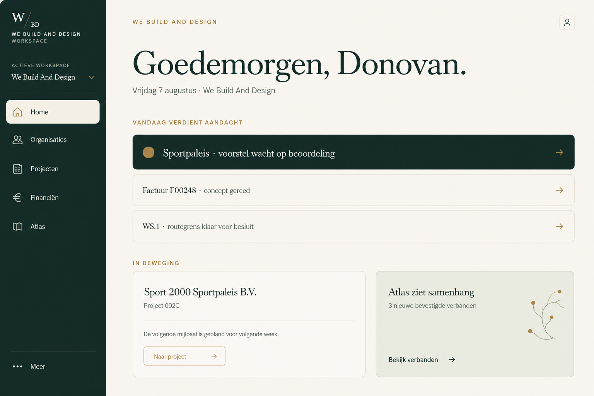
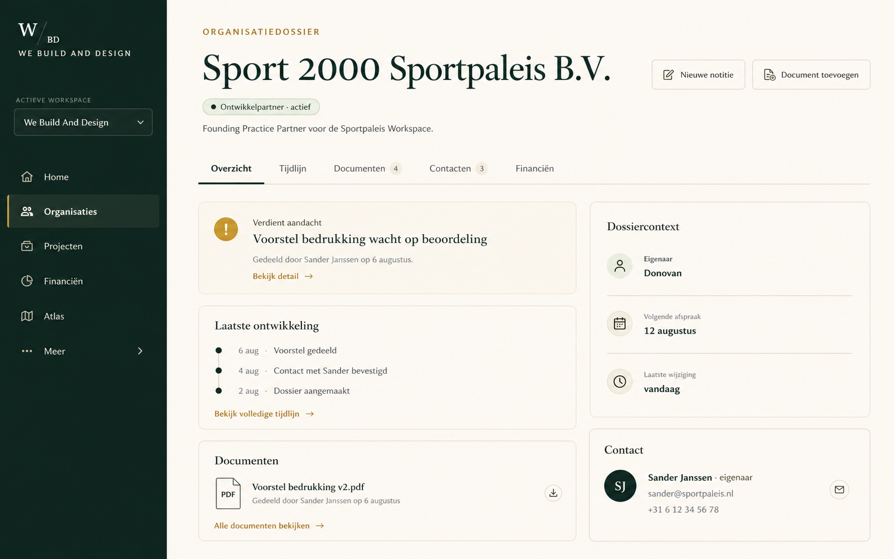
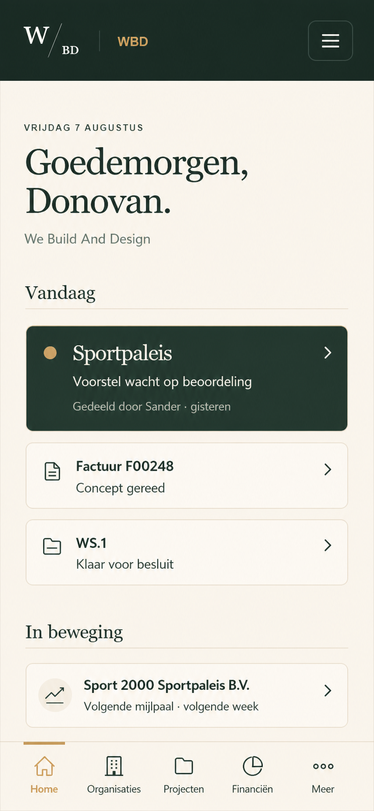
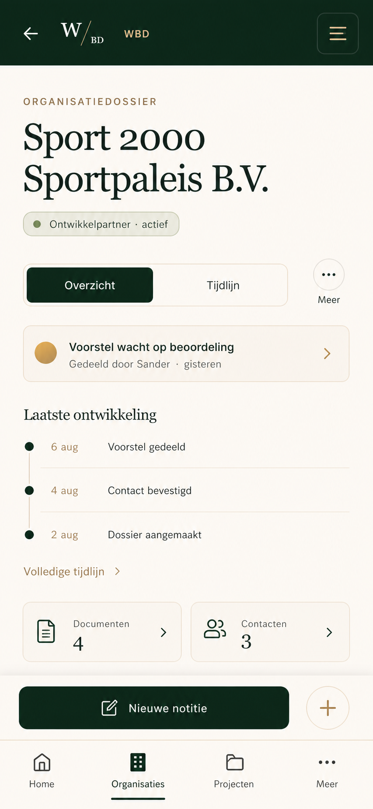

# WS-VIS.1 — Workspace Visual Direction Concept

**Date:** 2026-08-07  
**Status:** **VISUAL CONCEPT GO — NO-GO for implementation**  
**Source:** WS-VIS.0 actual local baseline, Canonical Workspace Review and WS.1–WS.5 direction  
**Method:** isolated raster concepts generated with the built-in image generation workflow  
**Application/code/CSS/infrastructure/production changes:** none

## 1. Direction in one sentence

The proposed direction is **the existing WBD Workspace grown up**: the same warm editorial identity and calm trust model, but with cream as the daily working surface, dark green as a deliberate anchor rather than an all-over background, more breathing room, clearer attention and genuinely mobile navigation.

This is not a generic SaaS dashboard and not a rebuild proposal. The concepts are decision material; exact spacing, copy, icons, responsive behavior and component states still require an implementation specification after a separate human GO.

## 2. Concept 1 — Workspace Home, desktop

**Deliberately retained**

- W/BD mark, We Build And Design identity and active Workspace selector;
- dark-green navigation family, cream, restrained gold and editorial serif display type;
- organisation/project/finance/Atlas context rather than generic metrics;
- quiet professional tone and human decision language.

**Lighter and more modern**

- a slim dark navigation rail replaces the large dark canvas;
- warm cream becomes the primary long-use surface;
- a practical editorial grid uses the desktop width without filling it with dashboard tiles;
- hairline borders and restrained surfaces replace heavy card blocks;
- meaningful line icons improve scanning without becoming decoration.

**WS-VIS.0 friction addressed**

- Home is no longer a dated static presentation page or oversized hero;
- “Vandaag verdient aandacht” gives one clear work start;
- related project, finance and Atlas context remain visible without competing equally;
- one gold dot communicates relevance without a notification centre.

## 3. Concept 2 — Organisation dossier, desktop

**Deliberately retained**

- organisation-first navigation and Sport 2000 Sportpaleis B.V. as realistic example content;
- dossier, documents, history, contacts, finance and human review as the core model;
- WBD palette, typographic character and calm professional framing.

**Lighter and more modern**

- the dossier opens as an overview with status, attention, recent history and context;
- forms are invoked through “Nieuwe notitie” or “Document toevoegen” instead of dominating the page;
- tabs make dossier depth explicit while keeping the current context stable;
- cards are quiet containers with fine borders, not large dark panels.

**WS-VIS.0 friction addressed**

- persistent upload/contact forms no longer compete with the actual organisation story;
- the timeline becomes readable history rather than a secondary form column;
- desktop space is used for a clear primary/secondary hierarchy;
- documents and contacts are visible summaries with direct paths to detail.

Sportpaleis remains example content and the first practice partner; it is not platform branding or the architecture basis.

## 4. Concept 3 — Workspace Home, mobile

**Deliberately retained**

- the W/BD identity, warm green/cream/gold family and editorial heading style;
- the same attention, organisation, project and finance meaning as desktop;
- calm rather than urgency-driven visual communication.

**Lighter and more modern**

- a compact native mobile app bar replaces a compressed desktop header;
- a fixed bottom navigation gives four primary destinations plus More;
- generous touch targets and short list rows make the Workspace usable one-handed;
- the heading is expressive but no longer consumes most of the first viewport.

**WS-VIS.0 friction addressed**

- no horizontally scrolling desktop navigation;
- no clipped navigation labels;
- daily priority is visible before long narrative content;
- the mobile Home presents one primary attention item and two compact secondary items;
- content density is reduced without turning the screen into empty decoration.

The top menu is intended for Workspace/account/context functions. The bottom navigation carries daily destinations. This anticipates installable/PWA use without designing offline, push or install flows in this phase.

## 5. Concept 4 — Organisation dossier, mobile

This optional concept validates the direction on the most difficult WS-VIS.0 journey.

**Deliberately retained**

- organisation identity, status, attention, timeline, documents, contacts and human action;
- visual continuity with desktop and the WBD brand family.

**Lighter and more modern**

- Overview and Timeline remain directly available; less-frequent sections move behind More;
- one attention row and three timeline entries establish context quickly;
- Documents and Contacts are compact destination summaries;
- a persistent “Nieuwe notitie” action is available without opening a form.

**WS-VIS.0 friction addressed**

- the approximately 2287-pixel baseline journey is shortened conceptually;
- multiple always-open forms disappear from the default flow;
- actions, tabs and bottom navigation are designed as real mobile targets;
- title, state and recent activity remain understandable within one screen.

## 6. Shared visual system proposed by the concepts

| Layer | Proposed role |
|---|---|
| Warm cream | primary reading and working surface for long daily use |
| Warm dark green | brand anchor, navigation, selected/primary attention surfaces |
| Muted gold | active state, one meaningful attention signal, restrained interaction accent |
| Editorial serif | page identity, organisation names and meaningful headings |
| Readable sans serif | navigation, metadata, status and operational copy |
| Hairline borders | grouping and rhythm instead of heavy filled panels |
| Restrained radius/shadow | tactile hierarchy without generic floating SaaS cards |
| Line icons | scanning and affordance only; icons never replace essential labels |

The dark green should not disappear: its reduction makes its use more meaningful. Cream should feel warm and paper-like, not like a pure-white productivity suite.

## 7. Elements that remain

1. W/BD mark and We Build And Design name.
2. Warm dark green, cream and muted gold as the recognisable family.
3. Editorial serif typography where hierarchy benefits from it.
4. Calm, thoughtful and professional tone.
5. Organisation-first dossiers.
6. Project, finance and Atlas provenance/context.
7. Human review, Candidate/Confirmed and explicit decision states.
8. Attention rather than notifications.
9. Sportpaleis as realistic practice-partner content, not the platform basis.
10. A persistent, recognisable Workspace shell.

## 8. Proposed changes

1. Make cream the primary daily workspace surface and reduce full-page darkness.
2. Narrow the desktop navigation rail and clarify the active route.
3. Replace static Home presentation with a calm daily-attention start.
4. Reduce the number of equally prominent cards.
5. Move dossier forms behind explicit actions or contextual drawers/dialogues.
6. Give timelines, documents, contacts and finance a stable dossier information architecture.
7. Use meaningful compact icons and retain text labels.
8. Establish 44–48 px minimum mobile interaction targets in the later specification.
9. Replace horizontal mobile desktop navigation with an app bar plus bottom navigation.
10. Shorten mobile dossier journeys through summaries, progressive disclosure and contextual actions.
11. Use muted-gold attention marks sparingly; no unread-count culture by default.
12. Let responsive hierarchy change, rather than merely shrinking the desktop composition.

## 9. Human design choices

The direction can move to specification only after a human chooses or confirms:

1. **Desktop rail:** keep the concept’s persistent slim rail, or allow a collapsible compact state?
2. **Mobile primary navigation:** confirm `Home / Organisaties / Projecten / Financiën / Meer`; the optional dossier concept uses four destinations because it emphasises the content screen, so the definitive pattern must be reconciled.
3. **Attention strength:** should the primary item use a full dark-green row, or a lighter cream row with only a gold marker?
4. **Typography scale:** accept the expressive serif size shown here, or reduce it one step for greater information density?
5. **Dossier actions:** use page-level drawers/dialogues for “Nieuwe notitie” and “Document toevoegen”, or navigate to dedicated focused routes?
6. **Atlas visibility:** retain a quiet Home context card, or surface Atlas only when a confirmed relationship has immediate relevance?

Recommended defaults are: persistent slim desktop rail; five-item mobile bottom navigation; dark-green treatment only for the single highest-priority item; slightly reduced final heading scale; dedicated focused mobile routes and desktop drawers; Atlas only for meaningful confirmed context.

## 10. Relationship to WS.1–WS.5

| Phase | Visual implication from WS-VIS.1 |
|---|---|
| WS.1 — Route/Application Boundary | stable Home, organisation and focused-action routes; clear active-route treatment |
| WS.2 — Identity/Organisation/Permissions | visible active Workspace, role-aware actions and organisation context without exposing infrastructure concepts |
| WS.3 — Durable Central Data | document/timeline/contact summaries with explicit state, loading, empty and failure designs later |
| WS.4 — Mobile Experience | app bar, bottom navigation, touch targets, responsive hierarchy and shorter focused journeys |
| WS.5 — Dynamic Home/Attention | one primary attention item, calm secondary relevance and no notification dashboard |

Visual implementation should not start by styling the current structure indiscriminately. WS.1 establishes the route boundary; the approved visual system can then be implemented incrementally, with WS.4 and WS.5 using these concepts as direction rather than pixel-perfect specifications.

## 11. GO/NO-GO advice

- **WS-VIS.1 visual direction:** **GO for human review.** The four concepts form a coherent, recognisably WBD direction and directly address the major baseline frictions.
- **Pixel-perfect implementation from these PNGs:** **NO-GO.** Generated raster text, spacing and components are illustrative and require deterministic specifications.
- **Next step after human approval:** **GO for `WS-VIS.2 — Visual System & Responsive Interaction Specification`**, limited to tokens, typography scale, grid, navigation behavior, core component states, mobile patterns and annotated screen specifications.
- **Application/CSS implementation:** **NO-GO until WS-VIS.2 and the relevant WS phase receive separate explicit human GO.**

## 12. Generation record

**Mode:** built-in image generation tool; no CLI/API key, package installation or code prototype.  
**Reference role:** WS-VIS.0 screenshots were style/structure references, not edit targets.  
**Saved outputs:** `docs/atlas/evidence/ws-vis-1/2026-08-07/`.

Final prompt set, summarised without changing intent:

1. **Home desktop:** high-fidelity WBD desktop Home; slim dark-green rail; warm cream canvas; “Goedemorgen, Donovan”; one primary attention item, two secondary items, Sportpaleis/Project 002C and Atlas context; no charts, gradients, glass or generic SaaS language.
2. **Dossier desktop:** high-fidelity Sport 2000 Sportpaleis B.V. living dossier; overview/timeline/documents/contacts/finance tabs; attention, recent history, dossier context and actions on demand; no open upload form or CRM table wall.
3. **Home mobile:** 390×844 daily Home; compact app bar, five-item bottom navigation, 48 px-equivalent targets, one attention card and compact secondary work; no horizontal navigation or notification badges.
4. **Dossier mobile:** 390×844 living dossier; Overview/Timeline/More, concise attention and history, document/contact summaries and focused “Nieuwe notitie” action; no always-open forms or shrunken desktop shell.

Across every prompt: preserve WBD dark green/cream/muted gold, editorial serif plus readable sans serif, calm attention-first hierarchy and realistic Dutch WBD context; avoid bright tech colours, excessive white, gradients, glassmorphism, gimmicks, lorem ipsum and watermarks.

**STOP:** no implementation follows from this concept document.
