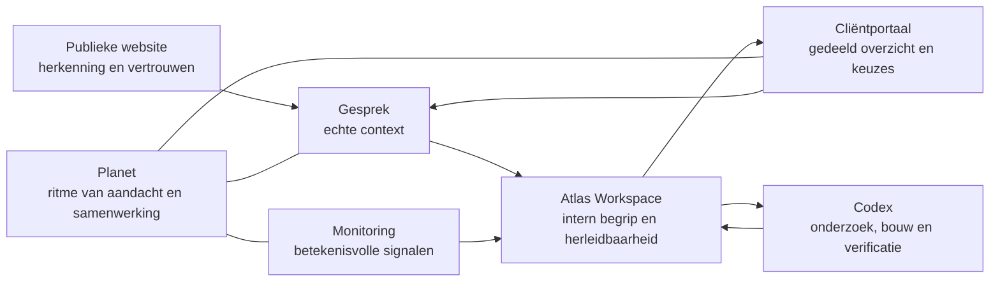

# Atlas — Weekendopdracht 001

**Status:** architectuurkandidaat — geen implementatie-GO  
**Datum:** 27 juli 2026  
**Scope:** publieke website, cliëntportaal, Atlas Workspace, monitoring en doorlopende samenwerking  
**Bronnen:** `Foundation.md`, actieve Atlas-besluiten, de huidige publieke Experience en de bestaande Workspace-modellen

## Doel

Deze documentatieset onderzoekt hoe de huidige We Build And Design Experience kan doorgroeien tot één samenhangend ecosysteem. Zij introduceert geen nieuw product en geeft geen toestemming om functionaliteit te bouwen.

De kern is:

> Eén werkelijkheid, verschillende vensters, ieder met een eigen verantwoordelijkheid.

De ondernemer hoeft de onderliggende systemen niet te beheren. We Build And Design en Atlas zorgen dat de juiste betekenis op het juiste moment zichtbaar wordt.

## Ecosysteem in één beeld

Planet is in dit model geen extra dashboard. Het is het samenwerkingsritme dat gesprek, monitoring, interpretatie en een passende volgende stap met elkaar verbindt.

## Vaste grenzen

- De publieke website helpt een ondernemer zichzelf en zijn vraag herkennen. Zij toont geen interne casekennis.
- Het cliëntportaal toont de gedeelde samenwerking. Het is geen kopie van de Atlas Workspace.
- De Atlas Workspace bewaart intern begrip, onzekerheden, bronnen, besluiten en herleidbaarheid.
- Monitoring levert signalen aan Atlas. Een signaal wordt pas klantwaarde na context en interpretatie.
- Planet is een digitaal partnerschap. Het is geen verplicht hosting-, SSL- of technisch onderhoudspakket.
- Codex mag zelfstandig werken binnen een bevestigde opdracht en bouwgrens. Donovan blijft verantwoordelijk voor betekenisvolle ondernemers-, publicatie- en bedrijfsbesluiten.
- De toekomstige Atlas Experience Preview blijft Horizon en valt buiten deze opdracht.

## Eén bron, meerdere bruikbare uitkomsten

Eén gesprek of review kan meerdere resultaten opleveren:

- een bron in Workspace;
- een bevestigde wens in het portaal;
- een onzekerheid die eerst onderzocht moet worden;
- een actie voor WBD of de ondernemer;
- een monitoringvraag;
- een mogelijke publieke kennisbron.

Die resultaten ontstaan niet automatisch. Iedere overgang heeft een passende bevestiging, zichtbaarheid en eigenaar nodig. Daarmee voorkomt Atlas dat een losse uitspraak stilzwijgend een opdracht, claim of publicatie wordt.

## Documenten

1. [`01-EXPERIENCE-EN-ECOSYSTEEM.md`](01-EXPERIENCE-EN-ECOSYSTEEM.md) — herbruikbare Experience-principes en de rol van ieder venster.
2. [`02-CLIENTPORTAAL-CONCEPT.md`](02-CLIENTPORTAAL-CONCEPT.md) — cliëntportaal als samenwerkingsruimte, niet als dashboard.
3. [`03-PLANET-CONCEPT.md`](03-PLANET-CONCEPT.md) — eerste richting voor een doorlopend digitaal partnerschap.
4. [`04-MONITORING-SIGNALEN.md`](04-MONITORING-SIGNALEN.md) — signalen die tot betere ondernemersbesluiten kunnen leiden.
5. [`05-SAMENWERKINGSMODEL.md`](05-SAMENWERKINGSMODEL.md) — taakverdeling en contextoverdracht tussen Atlas, Codex en Donovan.

## Gezamenlijke onzekerheden

- Er is nog geen echte cliëntportaalpraktijk waarmee navigatie, taal en gebruiksritme kunnen worden gevalideerd.
- Planet is nog geen bevestigd aanbod. Prijs, capaciteit, inbegrepen werkzaamheden en verantwoordelijkheden zijn onderzoeksrichtingen.
- De huidige Workspace gebruikt lokale opslag en is niet geschikt als gedeelde productieomgeving.
- De eerste monitoringfrequentie en drempelwaarden kunnen pas op echte sites en echte bedrijfsdoelen worden vastgesteld.
- Toegang, privacy, bewaartermijnen, toestemming en publicatierechten moeten vóór iedere gedeelde implementatie expliciet worden besloten.

## Eerstvolgende betekenisvolle stappen

1. Gebruik de eerstvolgende echte samenwerking om te observeren welke informatie een ondernemer tussen gesprekken werkelijk nodig heeft.
2. Test het portaalconcept eerst als handmatig samengesteld samenwerkingsbeeld, zonder software te bouwen.
3. Voer één handmatige Planet-review uit op een echte website en noteer welke signalen daadwerkelijk tot een besluit leiden.
4. Laat Atlas voor één begrensde Codex-opdracht een volledige contextbrief voorbereiden en meet hoeveel terugvragen en herstelwerk overblijven.
5. Neem pas daarna afzonderlijke GO-besluiten over portaal, Planet, monitoringautomatisering of gedeelde infrastructuur.

